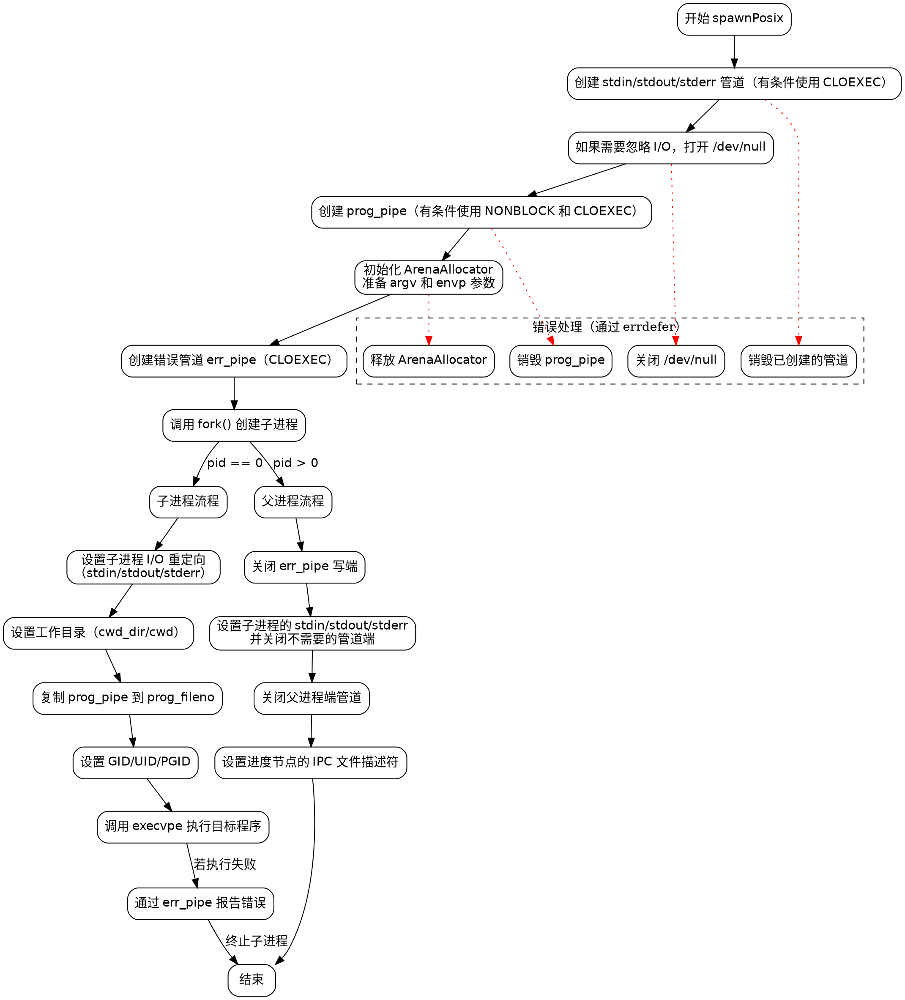

嗯，我需要为这个Zig函数`spawnPosix`绘制一个流程图。首先，我得仔细阅读代码，理解它的结构和逻辑流程。这个函数似乎是用来创建子进程的，处理各种管道和文件描述符，设置环境，最后执行新的程序。

首先，函数开始处创建了一些管道，比如`stdin_pipe`、`stdout_pipe`、`stderr_pipe`，这些管道使用了`CLOEXEC`标志，应该是为了防止子进程意外继承这些文件描述符。然后有一个`dev_null_fd`，可能是在需要忽略某些输入输出时打开`/dev/null`。接下来处理`prog_pipe`，可能用于进程间通信或者进度汇报。

之后，使用`arena_allocator`来分配内存，准备`argv`和`envp`参数，这些会在`execve`调用中使用。这里特别注意到了在`fork`和`execve`之间避免使用`malloc`，所以提前分配好内存。

然后创建了一个错误管道`err_pipe`，用于在子进程遇到错误时向父进程报告。接着调用`posix.fork()`创建子进程。在子进程中，设置各种I/O，改变工作目录，设置用户和组ID，最后通过`execvpe`执行目标程序。如果执行失败，通过`err_pipe`报告错误。

父进程部分关闭不需要的文件描述符，设置子进程的ID，处理标准输入、输出、错误的管道，关闭子进程中不需要的管道端，并设置进度节点的IPC文件描述符。

接下来，我需要将这些步骤转化为流程图。流程图通常包括开始、结束、处理步骤、判断分支、循环等。这里的函数有多个条件判断，比如根据`stdin_behavior`等决定是否创建管道，还有错误处理部分（`errdefer`）。

可能的步骤分解：
1. 开始函数。
2. 创建标准输入、输出、错误的管道（有条件）。
3. 处理`/dev/null`的打开（有条件）。
4. 创建进度管道`prog_pipe`。
5. 初始化内存分配器，准备`argv`和`envp`。
6. 创建错误管道`err_pipe`。
7. 调用`fork()`创建子进程。
   - 子进程部分：
     a. 设置I/O重定向。
     b. 改变工作目录。
     c. 设置用户、组ID。
     d. 执行目标程序，或报告错误。
   - 父进程部分：
     a. 关闭错误管道的写端。
     b. 设置子进程的ID和管道。
     c. 关闭不需要的管道端。
     d. 设置进度节点。
8. 结束函数。

需要注意错误处理部分，比如`errdefer`会在发生错误时执行清理操作。在流程图中，可能需要用条件分支来表示这些错误处理路径，或者作为单独的步骤。

此外，函数中有多个条件判断，比如`if (self.stdin_behavior == .Pipe)`，这需要在流程图中用判断框来表示不同的分支。

可能遇到的困难是如何将复杂的错误处理和资源清理步骤简洁地表示出来。可能需要将这些步骤合并或简化，以保持流程图的清晰。

总结下来，流程图的大致结构会是：

开始 → 创建管道 → 处理/dev/null → 创建prog_pipe → 准备参数 → 创建err_pipe → fork → 子进程流程和父进程流程并行 → 结束。

需要将子进程和父进程的步骤分开，可能用两个并行的流程线来表示。
================================================

这个流程图用 Graphviz 的 DOT 语言编写，展示了 `spawnPosix` 函数的主要逻辑：

1. **初始化阶段**：创建管道、处理 `/dev/null`、准备参数等
2. **fork 分支**：子进程和父进程分别执行不同的逻辑
   - **子进程**：设置 I/O 重定向、工作目录、权限，并最终执行目标程序
   - **父进程**：管理管道资源，监控子进程状态
3. **错误处理**：通过虚线框展示了 `errdefer` 的清理逻辑
4. **资源管理**：清晰地展示了管道和文件描述符的关闭时机

可以使用 Graphviz 工具（如 VS Code 的 Graphviz 插件或在线编辑器）渲染此代码生成矢量图。图中红色虚线表示错误处理路径，黑色实线表示正常执行流程。