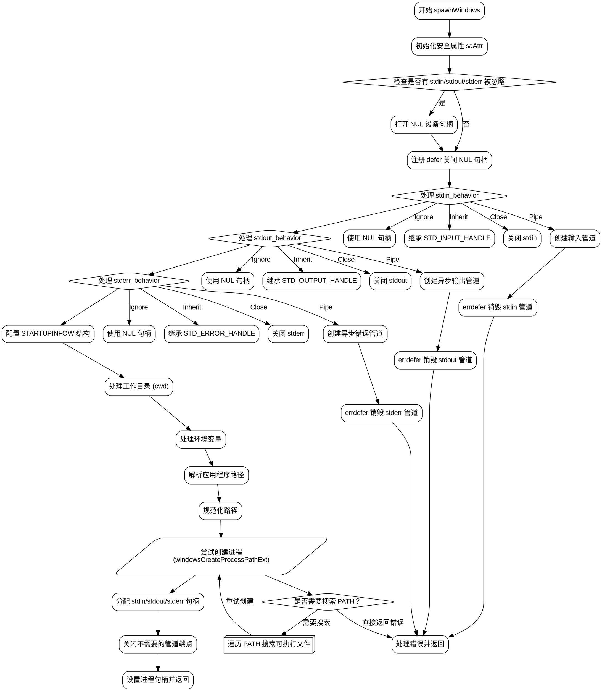

嗯，我需要用Graphviz来画出这个Zig函数的流程图。首先，我得仔细看看这个函数的结构，理解每个部分的作用。这个函数叫做spawnWindows，看起来是用来在Windows上创建子进程的。

首先，函数开始设置了一些安全属性saAttr，然后检查是否有标准输入、输出或错误被忽略。如果有的话，它会打开NUL设备。接下来处理标准输入、输出和错误的管道或继承，根据不同的StdIo行为设置不同的句柄。然后配置STARTUPINFOW结构，处理工作目录和应用程序路径，最后调用CreateProcess来启动子进程。还有错误处理和资源释放的部分。

接下来，我需要把这个过程分解成流程图中的各个节点。可能的分支包括判断是否有忽略的IO、不同StdIo行为的处理、路径解析、错误处理以及最终的进程创建和资源清理。每个条件判断会对应一个菱形节点，操作步骤用矩形节点，错误处理可能用不同的颜色或形状。

需要注意的是，函数中有多个errdefer和defer语句，这些是资源释放的部分，应该在流程图中体现出来。此外，处理环境变量、路径转换和命令行参数生成的部分也需要作为步骤包含进去。

可能需要将整个流程分成几个主要部分：初始化安全属性、处理IO配置、创建管道、配置启动信息、处理路径和环境变量、尝试创建进程、错误回退、资源清理。每个部分中的条件分支和循环（比如搜索PATH）也要在流程图中展示。

最后，确保流程图的箭头正确连接各个步骤，包括正常流程和错误处理路径。可能需要使用子图来分组相关的步骤，使图表更清晰。
================================================
