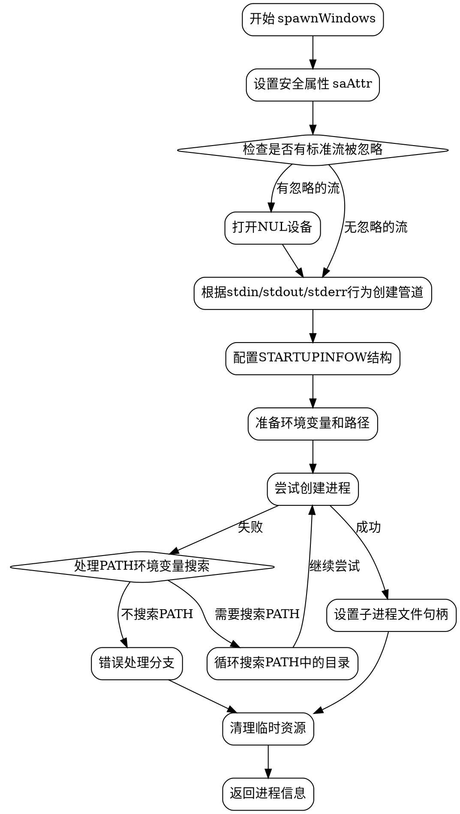

好的，我需要为给定的Zig函数`spawnWindows`生成一个流程图。首先，我应该仔细阅读并理解这个函数的功能和结构。

函数`spawnWindows`似乎是用于在Windows上创建子进程的。它处理标准输入、输出和错误流的重定向，设置安全属性，创建管道，处理环境变量和命令行参数，并最终调用Windows API来创建进程。

接下来，我需要确定流程图的主要步骤。流程应该从函数入口开始，逐步展示各个关键操作，比如安全属性设置、管道创建、处理标准IO行为、构建启动信息、创建进程、处理错误以及清理资源。

需要注意的条件和分支包括：
1. 处理标准输入、输出、错误的不同行为（Pipe、Ignore、Inherit、Close）。
2. 错误处理部分，如`errdefer`用于在发生错误时清理资源。
3. 路径处理和环境变量的设置。
4. 创建进程时的不同情况，比如是否需要搜索PATH环境变量。

此外，要确保流程图中包含所有重要的函数调用和判断逻辑，比如`windowsMakePipeIn`、`windowsMakeAsyncPipe`、`windowsCreateProcessPathExt`等，以及循环处理PATH环境变量的部分。

在绘制流程图时，需要使用Graphviz的语法，正确使用节点和边来表示流程的顺序和条件分支。可能需要使用菱形节点表示判断点，矩形节点表示操作步骤，箭头表示流程方向。同时，需要注意各个部分的连接是否正确，尤其是错误处理路径和资源释放部分。

最后，要验证流程图是否覆盖了函数的所有主要路径，没有遗漏关键步骤，并且逻辑清晰，易于理解。
================================================
