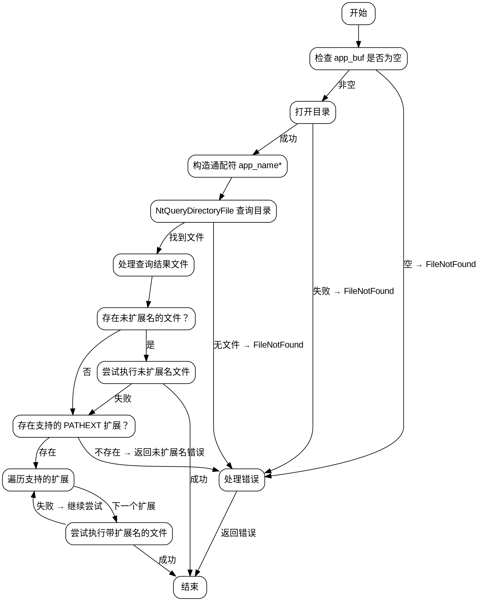

好的，我需要为这个Zig函数绘制流程图。首先，我得理解这个函数的功能和结构。这个函数是windowsCreateProcessPathExt，看起来是处理在Windows上创建进程的逻辑，特别是处理路径扩展（PATHEXT）的情况。

首先，函数开始时会检查app_buf的长度，如果为空则返回错误。然后使用defer语句恢复app_buf和dir_buf的原始长度。接下来，尝试打开目录，如果失败则返回错误。然后构造一个带有通配符的应用程序名称，用于查询目录中的文件。

之后，使用NtQueryDirectoryFile来查找匹配的文件。这里会遍历所有匹配的文件，检查是否有不需要扩展名的应用程序文件，或者是否有支持PATHEXT扩展名的文件。如果有未扩展名的文件存在，会尝试直接执行。如果没有找到，再尝试所有支持的扩展名。

在尝试执行时，如果是.bat或.cmd文件，会构造特定的命令行参数。如果执行失败，处理不同的错误情况，比如文件未找到、访问被拒绝或无效的exe文件。

最后，如果没有找到任何可执行的文件，返回错误。

接下来，我需要将这些步骤转化为流程图。流程图应该包括主要决策点和循环结构。例如：

1. 开始
2. 检查app_buf是否为空 → 是 → 返回错误
3. 打开目录 → 失败 → 返回错误
4. 构造通配符查询
5. 查询目录文件，遍历结果
6. 检查每个文件是否为目录 → 是 → 跳过
7. 检查文件名是否匹配未扩展名或支持扩展名
8. 如果未扩展名存在，尝试执行 → 成功 → 结束
9. 失败则尝试其他扩展名
10. 遍历所有支持的扩展名，尝试执行 → 成功 → 结束
11. 所有尝试失败 → 返回错误

需要注意处理错误的情况，比如访问被拒绝或无效exe时的不同处理。同时，循环遍历文件和扩展名的部分需要正确表示。

可能还需要处理一些条件分支，比如是否为.bat/.cmd文件，构造不同的命令行参数。此外，在错误处理部分，需要根据不同的错误类型决定是否继续尝试其他扩展名或直接返回错误。

最后，确保流程图的逻辑与代码一致，没有遗漏关键步骤。
================================================
