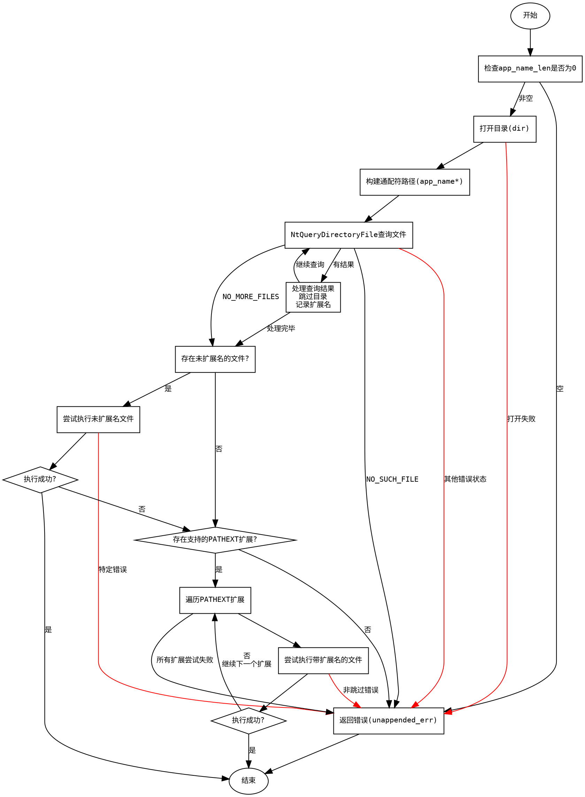

好的，我现在需要为这个Zig函数`windowsCreateProcessPathExt`绘制一个流程图。首先，我得仔细阅读代码，理解其逻辑结构和各个步骤之间的关系。

函数的主要目的是在Windows上创建进程，处理路径扩展（PATHEXT）相关的逻辑。看起来它会先检查是否存在未附加扩展名的应用程序，然后尝试各种PATHEXT扩展名。代码中涉及目录操作、文件查询、错误处理等。

首先，我需要确定函数的主要流程：

1. **初始化检查**：检查app_name是否为空，若空则返回错误。
2. **打开目录**：使用给定的目录路径，打开目录进行迭代。
3. **构建通配符路径**：在应用程序名称后添加通配符'*'，用于查询可能的匹配文件。
4. **查询目录文件**：使用NtQueryDirectoryFile查找匹配的文件，收集可能的扩展名。
5. **处理未附加扩展名的应用**：如果存在未附加扩展名的应用，尝试执行。
6. **处理PATHEXT扩展名**：遍历支持的扩展名，逐一尝试执行。
7. **错误处理**：在各个步骤中处理可能出现的错误，如文件未找到、访问被拒绝等。

接下来，需要考虑各个步骤之间的条件判断和循环结构。例如，查询目录文件时使用了一个while循环，处理扩展名时也有循环。此外，存在多个错误处理分支，需要正确连接这些分支到流程图中。

需要注意的是，代码中使用了defer语句，这些在流程图中可能需要表示为资源清理步骤，例如关闭目录。另外，条件判断如文件是否为目录、扩展名是否支持等，都需要在流程图中体现。

可能遇到的挑战是正确捕捉所有条件分支，尤其是错误处理部分，以及确保循环结构正确表示。此外，函数中涉及多个缓冲区操作和系统调用，这些可能需要简化为流程图的节点，避免过于复杂。

最后，确保流程图符合Graphviz的语法，正确使用节点、边、条件判断框等元素。需要将每个主要步骤分解为节点，条件判断用菱形框表示，流程箭头标明方向。
================================================
