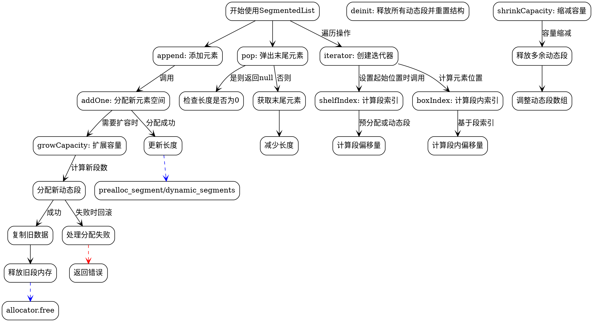

嗯，我现在要帮用户用Graphviz画一个Zig函数的流程图。用户提供的代码是SegmentedList的实现，看起来是一个分段的动态数组结构。首先，我需要理解这个结构的大致逻辑，然后根据函数的不同方法绘制流程图。

首先，SegmentedList结构体有两个主要部分：prealloc_segment预分配的空间和dynamic_segments动态分配的段。它管理元素的方式应该是当预分配空间用完时，动态分配更大的段。比如，每次动态段的大小可能是递增的，比如按指数增长，这样在添加元素时效率更高。

接下来，我需要考虑主要的函数，比如deinit、append、pop、addOne、growCapacity、shrinkCapacity等等。每个函数都有不同的逻辑，可能需要不同的流程分支。例如，append可能会调用addOne，而addOne又可能触发growCapacity来扩展容量。这时候流程图需要展示这些函数之间的调用关系以及条件判断，比如是否预分配空间足够，是否需要分配新的动态段。

此外，像setCapacity这样的函数需要处理扩容和缩容两种情况，流程图中应该分两个分支。而像shelfIndex和boxIndex这样的辅助函数可能用于计算索引，可能需要单独的子流程。

需要注意的是，Zig中的错误处理，例如allocator的返回错误，需要在流程图中体现可能的错误路径。例如，在growCapacity中，尝试分配新的dynamic_segments可能会失败，这时候errdefer会处理释放资源的逻辑，流程图中应该展示这一部分。

还有，迭代器Iterator和ConstIterator的结构可能需要单独的流程，展示如何遍历元素，处理预分配段和动态段的切换。

现在，我需要将这些逻辑拆分成不同的节点和判断条件，使用Graphviz的语法将它们连接起来。每个函数作为一个节点，条件判断用菱形框，流程箭头表示执行顺序。可能还需要子图来分组相关的函数，比如初始化、添加元素、容量管理、迭代器等。

可能遇到的困难是代码中存在多个相互调用的方法，需要正确梳理它们的调用关系。此外，一些复杂的逻辑如shelfCount和shelfIndex的计算可能需要详细说明，或者在流程图中简化为判断条件。需要确保流程图不过于复杂，同时覆盖主要执行路径。

最后，需要检查流程图是否准确反映了代码的结构，尤其是条件分支和循环部分。例如，在freeShelves函数中，循环释放动态段的部分需要用循环结构表示。此外，错误处理路径和正常路径需要明确区分。

总结步骤：
1. 确定主要函数和它们的逻辑流程。
2. 分析函数之间的调用关系。
3. 确定条件分支和循环结构。
4. 使用Graphviz的节点、边、条件框等元素绘制流程图。
5. 确保错误处理路径和资源管理（如alloc/free）被正确表示。
6. 验证流程图的准确性和可读性。
================================================

该流程图通过以下核心逻辑组织：

1. **初始化入口**：所有操作从`start`节点开始，可选择不同操作路径
2. **关键方法调用链**：
   - `append` → `addOne` → `growCapacity`扩容流程
   - 扩容时涉及动态段的内存分配、数据迁移和旧段释放
3. **容量管理双路径**：
   - 扩容时通过`growCapacity`分配指数增长的新段
   - 缩容时通过`shrinkCapacity`释放多余段内存
4. **迭代器核心逻辑**：
   - 通过`shelfIndex`和`boxIndex`实现分页式元素访问
   - 处理预分配段与动态段的边界转换
5. **错误处理路径**：
   - 用红色虚线表示内存分配失败时的回滚逻辑
   - 资源释放操作与allocator的交互

图中使用不同颜色和线型区分正常流程与错误处理流程，蓝色虚线表示数据存储结构的更新操作。