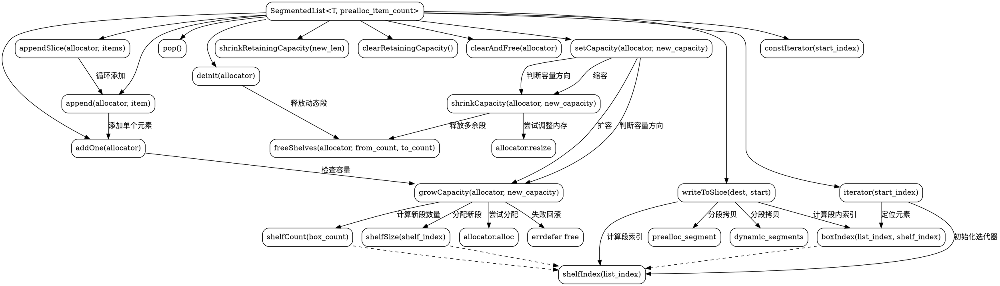

嗯，我需要为这个Zig代码中的SegmentedList函数生成一个Graphviz的流程图。首先，我需要理解这个函数的结构和各个部分的功能。

首先，这个函数定义了一个结构体，包含预分配段和动态段。结构体有初始化、释放内存、添加元素等方法。我需要把这些方法之间的调用关系和逻辑流程画出来。

比如，deinit方法会调用freeShelves来释放动态段的内存。append方法会调用addOne，而addOne又会调用growCapacity来确保容量足够。growCapacity和shrinkCapacity这两个方法负责动态调整容量，可能需要处理内存分配和释放。

然后，我需要确定流程图中的各个节点，比如函数入口、每个方法、条件判断、循环、错误处理等。例如，在growCapacity中，有判断新的容量是否超过旧的，如果是的话需要分配新的内存，否则直接返回。

另外，注意函数中的错误处理部分，比如errdefer的使用，这些需要在流程图中体现出来。比如在分配新内存时，如果失败，需要执行errdefer中的释放操作。

可能还需要考虑迭代器的部分，比如Iterator和ConstIterator的创建和使用，但也许这些可以简化，主要关注核心的内存管理和元素操作方法。

接下来，我需要把这些步骤转化为Graphviz的节点和边。每个函数或方法作为一个节点，条件判断作为分支，循环作为循环结构的节点。同时，需要标注各个节点之间的关系，比如调用、条件满足与否、循环过程等。

需要注意的是，Graphviz的语法是用节点和边来表示流程，可能需要使用子图来组织不同的功能模块，比如初始化、添加元素、调整容量、释放内存等部分。

在画图时，要确保逻辑清晰，层次分明，避免交叉线过多，可能需要调整节点的排列顺序和使用rankdir来调整方向，比如从上到下的布局。

最后，检查是否有遗漏的方法或关键步骤，确保流程图能够准确反映代码的执行流程和逻辑结构。
================================================
