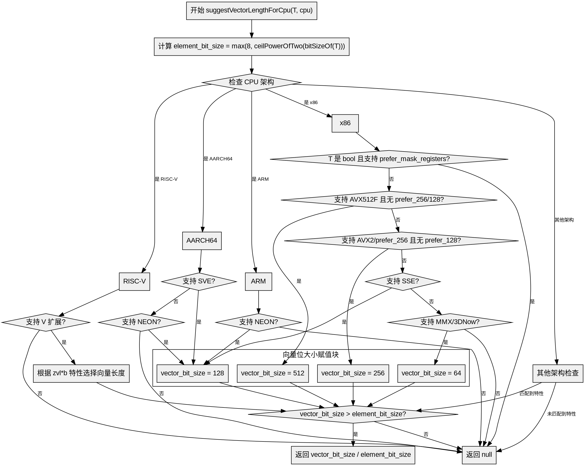

好的，我需要为给定的 Zig 函数 `suggestVectorLengthForCpu` 绘制一个流程图。首先，我需要理解这个函数的功能和逻辑结构。

函数的主要目标是基于给定的类型 `T` 和 CPU 架构特征，建议一个合适的向量长度（SIMD）。函数首先计算元素类型的位大小，然后根据不同的 CPU 架构（如 x86、ARM、PowerPC 等）检查特定的 CPU 特性，确定合适的向量位大小。最后，如果向量位大小大于元素位大小，返回它们的商，否则返回 null。

接下来，我需要将这一过程分解为流程图的基本步骤。流程图的开始是函数的入口点，然后依次处理各个条件分支。每个条件判断对应不同的 CPU 架构，每个架构下又有不同的特性检查，比如 x86 下的 AVX512F、AVX2、SSE 等。每个条件判断的结果会导致不同的向量位大小被选中。

需要注意的是，不同架构之间的条件判断是互斥的，比如先检查是否是 x86，然后是 ARM、AARCH64 等。每个架构分支内部可能有多个条件判断，如 x86 下根据不同的 CPU 特性设置不同的向量位大小。

在处理 RISC-V 架构时，有一个复杂的条件链，根据不同的 `zvl*b` 特性设置不同的向量位长度。这里需要确保所有可能的 `zvl*b` 特性都被覆盖，并正确设置对应的位长度。

另外，函数最后的逻辑是检查向量位大小是否大于元素位大小，如果是，则返回它们的商，否则返回 null。这也是流程图中的一个关键判断节点。

在绘制流程图时，需要确保所有的条件分支和返回路径都被正确表示，避免遗漏任何可能的执行路径。同时，使用合适的图形符号，如菱形表示条件判断，矩形表示处理步骤，箭头表示流程方向。

最后，根据用户要求，使用 Graphviz 的 DOT 语言来编写流程图，而不是 Mermaid。需要确保语法正确，节点和边的连接准确反映函数的逻辑流程。
================================================

将上述DOT代码粘贴到Graphviz工具（如https://edotor.net/）中，可以生成完整的流程图。流程图展示了：
1. 计算元素位大小
2. 按CPU架构分支
3. 各架构内部的特性判断
4. 最终根据向量位大小与元素位大小的比较返回结果
5. 所有未匹配情况返回null