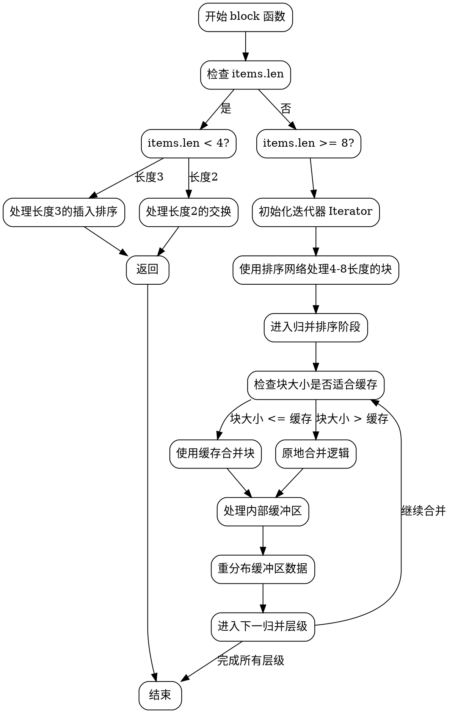

好的，我需要为给定的 Zig 函数 `block` 绘制一个流程图。首先，我需要理解这个函数的结构和逻辑流程。

首先，函数 `block` 是一个排序函数，看起来像是实现了一种块排序算法，可能是类似于 WikiSort 的稳定排序算法。代码中处理了不同长度的输入数组，对于小数组（长度小于4或8）使用插入排序或交换网络，对于较大的数组则进行归并排序，并且使用了缓存和块操作来优化性能。

流程图应该从函数的入口开始，然后根据不同的条件分支展开。比如，首先检查输入数组的长度，如果长度小于4，则进入特定的处理逻辑；否则进行更复杂的归并排序步骤。在归并排序过程中，可能涉及分块、合并、使用缓存、处理内部缓冲区等步骤。

需要注意的是，代码中有多个条件分支和循环结构，例如处理不同块大小的排序网络，合并时的不同情况处理（使用缓存、内部缓冲区等），以及最后的插入排序和缓冲区数据重分配。每个主要步骤需要作为流程图中的一个节点，并用箭头表示控制流。

此外，代码中的循环结构如 `while (!iterator.finished())` 和条件判断如 `if (items.len < 8)` 需要体现在流程图中，可能需要使用菱形框表示条件判断，矩形框表示处理步骤，箭头表示流程方向。

最后，确保流程图符合 Graphviz 的语法，使用正确的节点和边定义，避免使用 Mermaid 语法。可能需要将整个流程分解为多个子图或节点组，以保持清晰。
================================================

该流程图使用 Graphviz 语法绘制，主要步骤说明：

1. 函数入口检查数组长度
2. 对短数组（<4）进行特化处理
3. 对较长数组初始化迭代器并使用排序网络
4. 进入归并阶段后根据缓存适应性选择不同合并策略
5. 处理内部缓冲区并重分布数据
6. 循环进行多层级合并直到完成排序

关键决策点用菱形节点表示，操作步骤用矩形节点，箭头表示控制流方向。实际实现中每个主要代码块（如排序网络、缓存合并等）都对应流程中的一个处理节点。