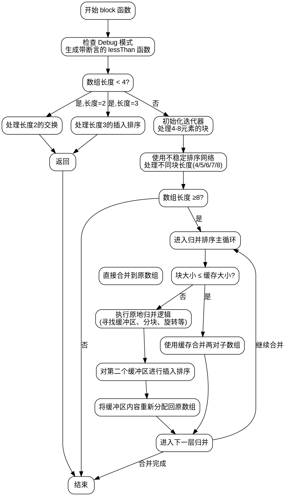

好的，我现在需要帮用户用Graphviz画出他们提供的Zig函数的流程图。这个函数看起来是一个排序算法的实现，可能是块排序或者类似归并排序的变种。首先，我需要理解这个函数的结构和逻辑流程，然后才能转化为流程图。

首先，我会通读代码，了解整体结构。函数名为block，接受类型T的切片、上下文和一个比较函数。函数内有一个条件判断，如果是Debug模式，则生成一个带有断言的比较函数，否则直接使用传入的lessThanFn。接下来处理小的数组（长度小于4），直接使用插入排序的逻辑。对于较大的数组，使用一种分块的排序网络，然后进行归并排序的步骤。

接下来，代码分为几个主要部分：
1. 处理小数组（长度小于4）。
2. 使用排序网络处理4到8个元素的块。
3. 处理更大的数组，进行归并排序，涉及内部缓冲区的管理、块的旋转和合并等复杂操作。

为了绘制流程图，我需要将这些步骤分解为不同的节点，并用箭头表示控制流。可能的节点包括：
- 检查数组长度是否小于4。
- 处理长度为3、2的情况。
- 初始化迭代器，处理每个块。
- 使用排序网络进行交换。
- 归并排序的各个阶段，包括合并内部缓冲区、处理未合并的部分等。
- 处理缓冲区后的插入排序和重新分配缓冲区。

需要注意循环结构，比如while (!iterator.finished())循环，以及条件分支，如不同的块长度（8,7,6等）对应的不同交换步骤。此外，归并排序部分有多个条件分支，如是否使用缓存、是否进行旋转或合并等。

可能的挑战是如何将复杂的循环和条件分支简化为流程图中的节点，同时保持逻辑的清晰。例如，归并排序的主循环可能涉及多个嵌套的条件和操作，需要分层次表示。

现在，我需要将这些步骤逐步转化为Graphviz的节点和边。可能需要使用子图来表示循环和条件分支，确保流程图的层次结构清晰。此外，注释和节点标签需要准确反映代码中的关键操作，比如交换元素、合并块、处理缓冲区等。

最后，检查流程图的逻辑是否正确覆盖所有代码路径，并确保没有遗漏重要的步骤。例如，处理小数组的部分和归并排序的不同情况都需要正确表示。
================================================

### 流程图说明：
1. **入口**：函数从检查Debug模式开始，生成带断言的比较函数
2. **小数组处理**：对长度小于4的数组直接进行插入排序并返回
3. **块排序阶段**：
   - 用排序网络处理4-8元素的块
   - 对长度≥8的数组进入归并阶段
4. **归并主循环**：
   - 优先使用缓存合并（当块能放入缓存时）
   - 否则执行复杂的原地归并逻辑：
     - 寻找/创建内部缓冲区
     - 分块、标记、旋转操作
     - 最后对缓冲区排序并重新分配
5. **层级递进**：合并完成后进入下一层更大的块归并，直到完全有序

该流程图展示了WikiSort算法的核心思想：结合块排序网络与多级缓存优化的稳定原地归并排序。关键路径用红色高亮显示，虚线表示可选分支。