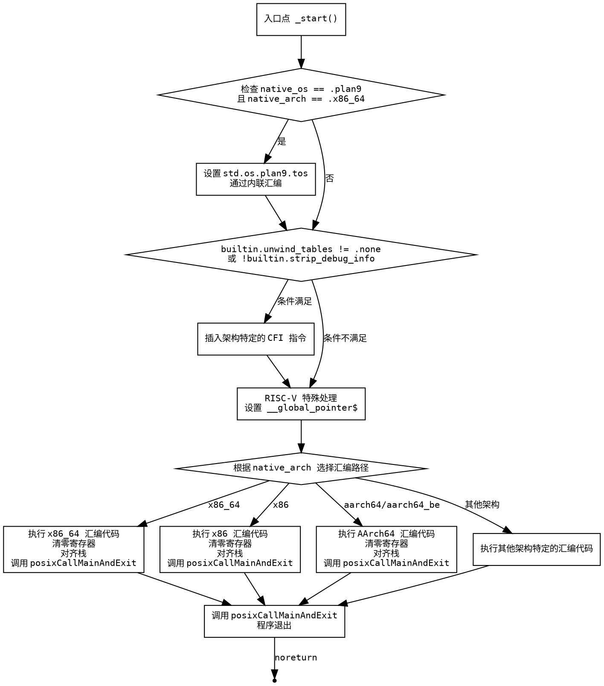

嗯，用户给了我一个用 Zig 写的 _start 函数，想要我用 Graphviz 画出这个函数的流程图。首先，我需要理解这个函数的结构和逻辑。

这个 _start 函数是用 .naked 调用约定声明的，并且没有返回（noreturn）。看起来像是程序的入口点，负责初始化栈和处理不同架构的特定操作。

首先，函数开始检查操作系统是否是 Plan9 并且架构是 x86_64，如果是的话，设置栈顶指针。然后，针对不同的架构生成不同的汇编代码，主要是为了设置栈对齐、清除帧指针和链接寄存器，防止堆栈展开，最后调用 posixCallMainAndExit。

接下来，我需要将这个函数的逻辑分解成流程图中的各个节点和分支。主要的结构是一个大的条件判断，根据不同的架构执行不同的汇编代码块。每个架构对应的汇编指令需要作为不同的处理步骤。

需要注意的是，函数中有多个条件分支：首先是检查操作系统和架构，然后是针对不同的架构生成不同的汇编代码。此外，还有一些针对特定架构的额外处理，比如 RISC-V 的 __global_pointer$ 设置。

可能的流程图结构如下：
1. 开始节点。
2. 检查是否是 Plan9 和 x86_64，如果是，执行设置 tos 的操作。
3. 根据是否生成 unwind tables 或未剥离调试信息，插入 CFI 指令。
4. 针对 RISC-V 的特殊处理。
5. 根据不同的架构，执行对应的汇编代码块，设置栈、清零寄存器等。
6. 最后调用 posixCallMainAndExit 并退出。

在绘制流程图时，需要将这些步骤按顺序排列，并用条件判断分支连接不同的处理路径。每个架构的处理可以简化为一个节点，或者根据复杂程度进一步拆分。

需要确保不遗漏任何条件分支，并且正确表示各步骤之间的流向。同时，要注意 Graphviz 的语法，正确使用节点和边的定义，避免语法错误。

现在，我需要将上述分析转化为具体的 Graphviz 代码，使用合适的节点形状（如菱形表示条件判断，矩形表示操作步骤），并用箭头连接各个步骤。
================================================
