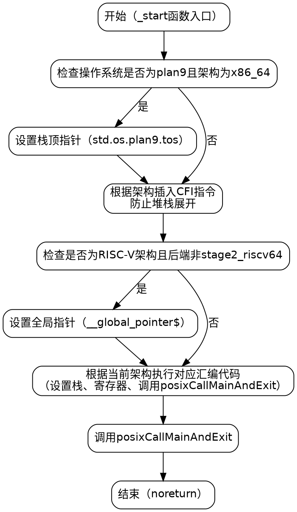

嗯，我需要为这个用Zig编写的_start函数绘制一个流程图。首先，我得仔细阅读代码，理解它的结构。这个函数是程序的入口点，使用了callconv(.naked)，意味着它不会有通常的函数序言和尾声，直接处理栈和寄存器的设置。

首先，函数检查当前的操作系统和架构是否是plan9的x86_64，如果是的话，设置栈顶指针。这部分需要作为一个判断分支。接下来，处理不同架构下的调试信息，防止堆栈展开。这里有多个条件判断，可能涉及不同的编译器标志。

然后，针对RISC-V架构处理全局指针的设置，这部分可能需要单独的分支。之后是主要的汇编代码块，根据不同的CPU架构执行不同的汇编指令，设置栈指针、清除寄存器等，最后调用posixCallMainAndExit函数。

流程图的结构应该是这样的：开始节点，然后是条件判断是否是plan9的x86_64，如果是，执行设置tos的操作。接着处理CFI指令，防止堆栈展开。然后检查是否是RISC-V架构，处理全局指针。之后进入主汇编代码，根据不同的架构分支处理不同的汇编指令，最后统一调用posixCallMainAndExit，结束流程。

需要注意的是，每个架构对应的汇编块都是不同的分支，可能需要为每个支持的架构绘制不同的处理路径。但由于架构很多，可能需要在流程图中用一个通用节点表示根据架构选择不同的汇编代码，然后指向调用主函数的步骤。

可能的结构：

1. 开始
2. 检查是否为plan9 x86_64 → 是：设置tos；否：跳过
3. 处理CFI指令（根据架构选择不同的指令）
4. 检查是否为RISC-V且后端不是stage2 → 是：设置gp；否：跳过
5. 根据当前架构执行对应的汇编代码块（这里可能需要多个分支，但为了简化，可以合并为一个判断节点）
6. 调用posixCallMainAndExit
7. 结束

由于代码中有大量的内联汇编和条件编译，具体流程图可能需要简化，突出主要分支和关键步骤，而不是每个架构的详细处理。这样可以保持流程图的清晰和可读性。
================================================

### 流程图说明：
1. **入口**：函数从`_start`入口开始。
2. **Plan9 x86_64检查**：判断是否为Plan9系统下的x86_64架构，若是则设置栈顶指针。
3. **CFI指令处理**：根据目标架构插入不同的调试指令（如`.cfi_undefined`），防止调试器继续展开堆栈。
4. **RISC-V后端检查**：若为RISC-V架构且未使用特定后端，则设置全局指针（`gp`）。
5. **架构相关汇编**：根据当前架构执行对应的汇编代码块（如设置栈对齐、清零寄存器等操作）。
6. **调用主函数**：最终调用`posixCallMainAndExit`进入程序主逻辑。
7. **结束**：函数标记为`noreturn`，流程终止。