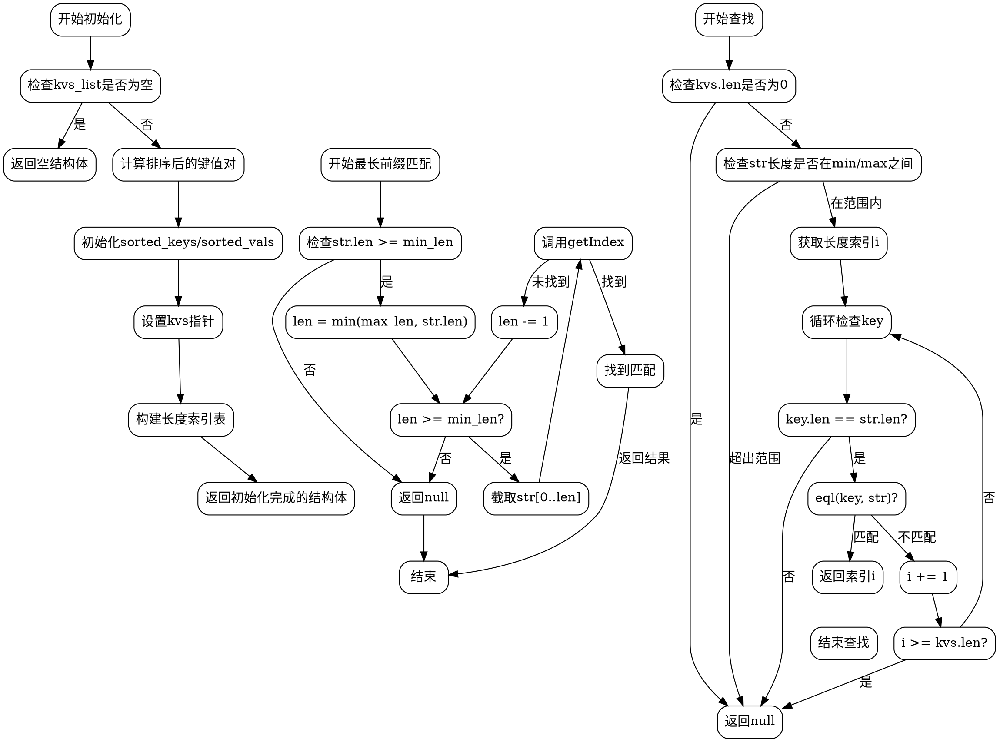

好的，我现在需要为提供的Zig代码中的`StaticStringMapWithEql`函数绘制一个流程图。首先，我需要理解这段代码的结构和逻辑。

首先，这个函数返回一个结构体类型，该结构体包含多个字段和方法。主要的方法包括`initComptime`、`init`、`deinit`、`has`、`get`、`getIndex`、`getLongestPrefix`等。每个方法有不同的逻辑，需要分别分析它们的流程。

从`initComptime`开始，它处理在编译时初始化的静态键值对。这里有一个排序过程，以及初始化长度索引。`init`方法类似，但使用动态内存分配。`deinit`负责释放资源。`get`和`getIndex`涉及查找逻辑，可能需要遍历键值对。`getLongestPrefix`则是寻找最长前缀匹配。

接下来，我需要确定如何将这些方法转换为流程图。通常，流程图的基本元素包括开始/结束节点、处理步骤、判断分支、循环等。每个方法可能有自己的流程，但整体结构可能涉及初始化、数据处理、查找等部分。

可能的挑战包括处理复杂的控制流，比如`initComptime`中的编译时操作，以及`getLongestPrefix`中的循环递减长度。需要确保每个判断条件和循环都被正确表示。

另外，注意代码中的错误处理，比如`init`方法中的`try`和`errdefer`，需要在流程图中体现可能的错误路径。不过，根据用户需求，可能只需关注正常流程。

最后，整合所有方法的流程，可能需要分块表示不同的函数，或者选择主要流程进行展示。由于Graphviz的流程图是层次结构，需要合理组织节点和连接，确保逻辑清晰。
================================================

该流程图包含三个主要部分：
1. **初始化流程**（蓝色部分）：处理`initComptime`和`init`方法的逻辑
2. **普通查找流程**（绿色部分）：展示`get`和`getIndex`方法的执行路径
3. **最长前缀匹配流程**（橙色部分）：描述`getLongestPrefix`的实现逻辑

各个流程通过：
- 菱形节点表示条件判断
- 矩形节点表示处理步骤
- 箭头表示控制流方向
- 不同颜色区块区分不同功能模块

可以通过Graphviz工具（如VSCode的Graphviz插件）渲染该DOT代码生成矢量图。