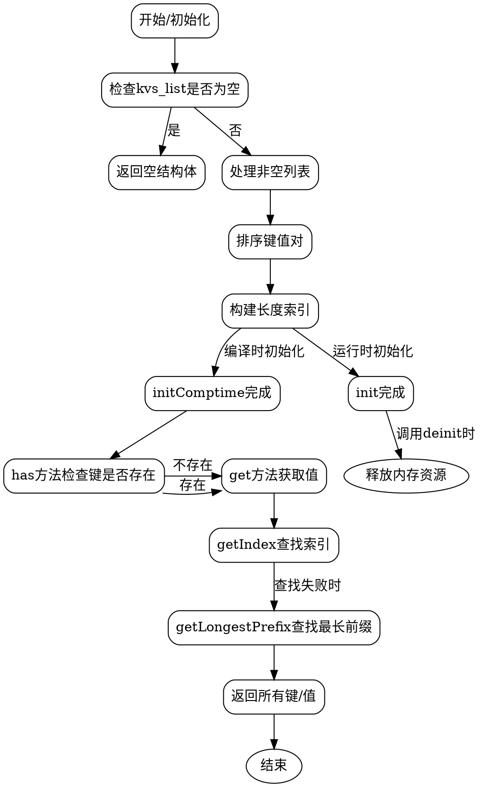

好的，我需要为提供的Zig代码中的`StaticStringMapWithEql`函数绘制一个流程图。首先，我得仔细理解这个函数的逻辑结构。

这个函数返回一个结构体类型，该结构体包含初始化方法`initComptime`和`init`，以及一些辅助方法如`has`、`get`、`getIndex`等。主要功能是创建一个静态的字符串映射，支持通过键查找值，包括最长前缀匹配。

流程图需要涵盖主要的流程分支，比如初始化时的不同路径（空列表与非空列表）、排序过程、索引构建，以及查找逻辑。需要注意`initComptime`是在编译时执行的，而`init`是在运行时分配内存的。

首先，主流程从调用`initComptime`或`init`开始。对于`initComptime`，处理空列表直接返回空结构体。非空列表则需要进行排序，构建键值对，设置索引等步骤。排序部分使用了自定义的排序上下文，可能需要处理分支配额。然后构建长度索引，记录每个长度对应的起始位置。

查找过程`get`和`getIndex`需要检查键的长度是否在有效范围内，然后遍历对应长度的键进行比较。而`getLongestPrefix`则需要从最大长度递减检查，直到找到匹配的最长前缀。

在绘制流程图时，需要分块表示各个函数的主要步骤，并用箭头连接决策点，如是否为空列表、长度是否在范围内等。同时注意处理错误和内存释放的部分，比如在`init`方法中使用`errdefer`来确保资源释放。

可能需要使用不同的形状来表示开始/结束节点、处理步骤、判断分支等。例如，菱形表示判断，矩形表示处理步骤，椭圆形表示开始和结束。

需要确保流程图的逻辑顺序正确，覆盖所有重要的函数和方法，并且步骤之间的转换清晰明了。同时，要注意不要遗漏异常处理或内存管理部分，如`deinit`方法中的资源释放。

最后，根据上述分析，整理出各个部分的流程图结构，确保每个函数的主要流程都被正确表示，并且分支逻辑准确无误。
================================================
