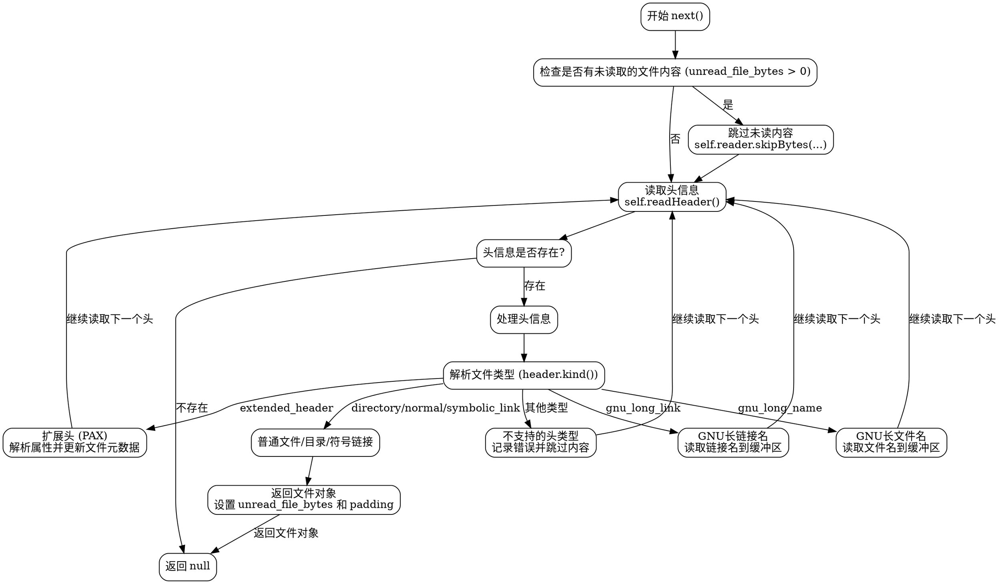

好的，我需要为提供的Zig代码中的`Iterator`函数生成一个流程图。首先，我需要理解这段代码的结构和逻辑流程。

首先，代码定义了一个`pub fn Iterator`函数，它返回一个结构体类型。这个结构体有多个成员变量，如`reader`、`diagnostics`、`header_buffer`等，以及一些方法，比如`readHeader`、`readString`、`next`等。

接下来，结构体中还嵌套定义了一个`File`结构体，包含文件名、链接名、大小等属性，以及相关的读写方法。

主逻辑集中在`next`方法中，它负责遍历tar归档文件中的各个条目。根据不同的文件类型（如目录、普通文件、符号链接等），该方法处理不同的情况，并可能读取扩展头或跳过不支持的头类型。

为了绘制流程图，我需要将整个`next`方法的逻辑分解成步骤，并用图形化的方式表示。可能的步骤包括：

1. 检查是否有未读取的文件内容，如果有则跳过。
2. 读取下一个头信息。
3. 根据头信息的类型（如目录、普通文件、符号链接等）进行处理。
4. 处理扩展头信息（如长文件名、长链接名等）。
5. 处理不支持的头类型，记录错误或跳过。
6. 返回文件信息或继续下一个循环。

在绘制过程中，需要注意条件判断（如`switch`语句）、循环结构（如`while`循环）以及可能的错误处理路径。此外，`next`方法中调用的其他辅助函数（如`readHeader`、`readString`）也需要在流程图中适当体现其作用。

最后，生成的流程图应使用Graphviz的DOT语言描述，确保每个步骤和决策点清晰可见，箭头正确指向下一个步骤或分支。
================================================

### 流程图说明：
1. **入口**：从`next()`方法开始。
2. **检查未读内容**：如果有未读取的文件内容，先跳过这些字节。
3. **读取头信息**：调用`readHeader()`读取tar头信息。
4. **头信息处理**：
   - 如果是**普通文件/目录/符号链接**，直接构造文件对象并返回。
   - 如果是**GNU长文件名/长链接名**，将内容读取到缓冲区，继续处理下一个头。
   - 如果是**扩展头 (PAX)**，解析属性并更新文件元数据，继续处理下一个头。
   - 如果是**不支持的类型**，记录错误并跳过内容。
5. **循环**：处理完每个头后，回到读取头的步骤，直到没有更多头信息。
6. **结束**：当所有头处理完毕，返回`null`表示迭代结束。

该流程图通过条件分支清晰地展示了`next()`方法处理不同tar头类型的逻辑流程。