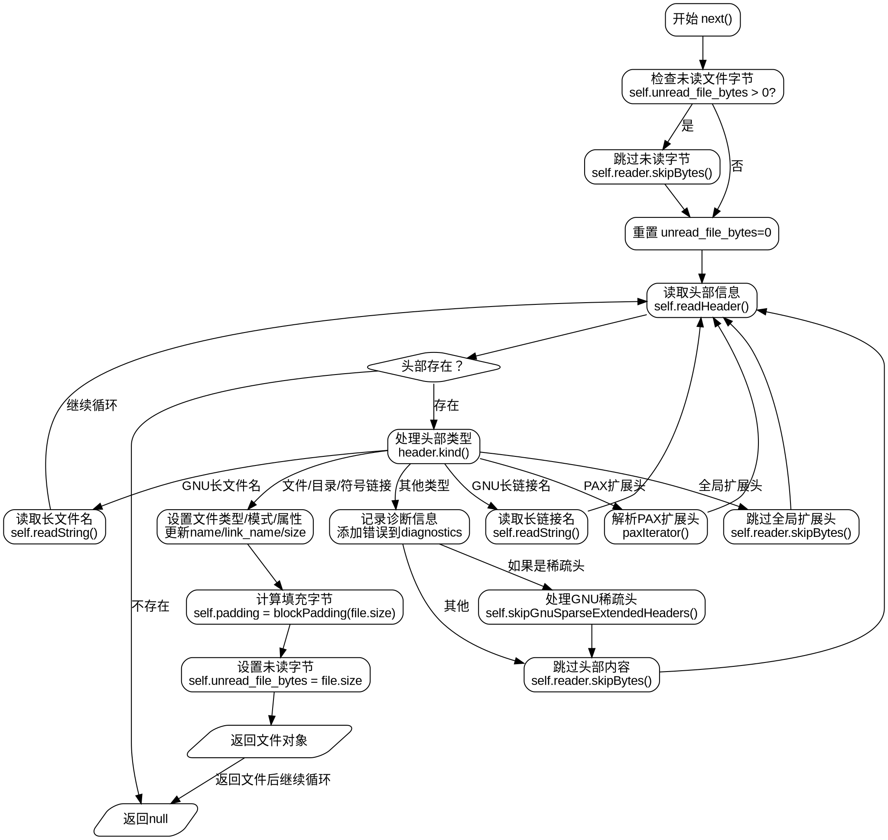

好的，我需要帮用户用Graphviz画出这个Zig函数的流程图。首先，我需要仔细阅读并理解提供的Zig代码。这个函数`pub fn Iterator`返回一个结构体，该结构体处理tar文件的迭代，包括读取头部信息、处理不同类型的文件条目等。

首先，确定流程图的入口点。从`next`方法开始，因为这是主要的迭代逻辑。用户调用`next`时，会检查是否有未读取的文件字节，如果有则跳过。然后进入一个循环，读取头部信息。根据头部类型（如目录、普通文件、符号链接等），处理相应的逻辑，设置文件属性，并返回文件信息。对于特殊类型的头部（如长文件名、扩展头等），需要额外的处理，如读取字符串或解析扩展属性。

需要注意条件分支，例如不同类型的头部处理，以及错误处理的情况。例如，当遇到不支持的头部类型时，可能需要记录诊断信息或跳过数据块。此外，处理扩展头时，可能会进入子流程，如解析PAX属性。

接下来，将每个步骤转化为Graphviz的节点和边。使用菱形表示条件判断，矩形表示处理步骤，箭头表示流程方向。确保循环结构正确表示，例如读取头部直到没有更多头部或满足返回条件。

还需要注意错误处理的路径，如`try`操作可能导致的提前返回错误。这些错误路径需要用单独的边表示，或者在流程图中标注可能的错误出口。

最后，整合所有步骤，确保逻辑连贯，没有遗漏重要的处理分支。可能需要对代码中的辅助函数（如`readHeader`、`readString`等）进行简要表示，或将其逻辑包含在主流程图中，以保持流程图的清晰性。
================================================

该流程图使用Graphviz语法表示以下关键流程：
1. 初始化时检查未读字节
2. 循环读取tar头部
3. 根据头部类型分支处理：
   - 普通文件/目录/符号链接
   - GNU长文件名/长链接名
   - PAX扩展头
   - 全局扩展头
   - 其他不支持类型
4. 处理错误情况和诊断记录
5. 最终返回文件对象或null

循环结构通过返回读头部步骤实现，错误处理路径用红色虚线表示，关键判断点使用菱形节点，返回结果使用平行四边形节点。