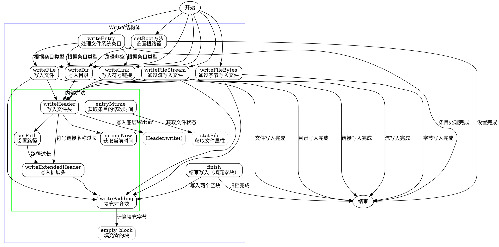

嗯，我需要为这个Zig语言中的`Writer`函数绘制流程图。首先，我得仔细阅读代码，理解它的结构和各个方法的功能。看起来这个`Writer`是一个泛型结构体，用来创建tar归档文件的写入器。它包含多个方法，比如`writeDir`、`writeFile`、`writeFileStream`等，每个方法处理不同类型的文件或目录的写入。

首先，我需要确定流程图的范围。用户提供的代码是`tar/writer.zig`中的`pub fn Writer`函数，它返回一个结构体类型。这个结构体有多个方法，比如`setRoot`、`writeDir`、`writeFile`等等。每个方法可能有自己的流程，但用户可能希望的是整个`Writer`结构体的主要流程，或者是各个方法的调用关系。

接下来，我需要考虑如何将这些方法组织成一个流程图。可能的结构是从`Writer`的初始化开始，然后展示各个写入方法（如`writeDir`、`writeFile`等）的调用流程，以及它们如何调用内部的方法如`writeHeader`、`setPath`等。还需要处理错误路径和条件分支，比如处理长文件名时写入扩展头的情况。

另外，注意代码中有一些条件判断，比如在`setPath`方法中，如果路径过长，会写入扩展头。这些条件分支需要在流程图中体现出来。同时，像`writePadding`和`finish`这样的辅助方法也需要被包含进去。

可能会遇到的问题是如何将Zig语言中的错误处理（如`try`关键字）转换为流程图的决策节点。例如，当调用`header.setPath`时，如果出现错误`error.NameTooLong`，则执行写入扩展头的逻辑。这需要在流程图中表示为一个条件判断，导致不同的处理分支。

另外，`writeExtendedHeader`方法被多个地方调用，比如处理长路径和长链接名，这也需要明确在流程图中显示其调用关系。

最后，需要确保流程图的每个步骤都清晰，并且正确反映代码的逻辑结构。可能需要将复杂的函数拆分成多个子流程，以确保可读性。

总结一下，绘制流程图的步骤可能包括：
1. 确定入口点（可能是`Writer`结构体的初始化）。
2. 绘制各个公共方法（如`setRoot`、`writeDir`等）的调用流程。
3. 展示内部方法（如`writeHeader`、`setPath`等）的调用和条件分支。
4. 处理错误路径和异常情况。
5. 连接所有相关的方法和条件判断，形成完整的流程图。
================================================

### 流程图说明：
1. **入口**：通过公共方法（如`setRoot`、`writeFile`等）启动流程。
2. **核心逻辑**：
   - `writeHeader`处理文件头的通用写入逻辑，并可能触发扩展头写入。
   - `setPath`在路径过长时调用`writeExtendedHeader`。
   - 所有文件写入方法最终调用`writePadding`对齐块大小。
3. **分支处理**：
   - 路径/链接名过长、符号链接等场景触发扩展头逻辑。
   - `writeEntry`根据文件类型自动调用对应的写入方法。
4. **结束**：通过`finish`写入两个空块完成归档。