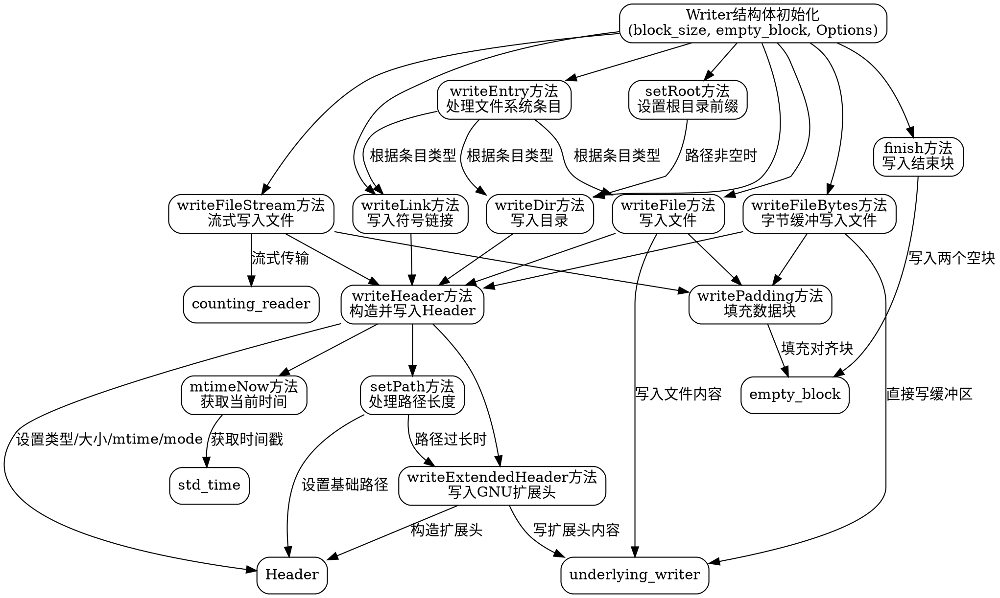

嗯，我现在需要为这个Zig语言的tar.Writer函数画一个流程图。首先，我需要理解这个代码的结构和各个方法之间的关系。这个Writer函数返回一个结构体，里面有很多方法，比如writeDir、writeFile、writeFileStream等等。每个方法处理不同的文件类型，比如目录、普通文件、符号链接等。

首先，主结构是Writer，它有一个underlying_writer，可能是底层的输出流。然后有很多方法，比如setRoot设置根目录，writeDir写入目录，writeFile写入文件等等。每个方法内部可能调用writeHeader来生成tar的头部信息，然后写入数据，最后处理填充。

流程图应该从用户调用Writer开始，然后根据不同的写入操作（目录、文件、链接等）分支处理。每个分支可能需要设置不同的头部信息，处理路径长度，可能写入扩展头部，然后写入数据，最后处理填充和对齐。finish方法会写入两个空块结束。

需要注意各个方法之间的调用关系，比如writeDir调用writeHeader，而writeHeader内部可能调用setPath，而setPath在路径过长时会调用writeExtendedHeader。这些流程都需要在图中体现出来。

可能的结构是，顶层是Writer结构，各个方法作为节点，箭头表示调用关系。例如，writeFile -> writeHeader -> setPath，如果路径过长则调用writeExtendedHeader。每个方法结束后可能有写入数据和填充的步骤。finish方法在最后写入两个空块。

需要确保所有可能的路径都被覆盖，比如处理符号链接时的link_name处理，写入扩展头部的情况，以及填充数据块的部分。同时，错误处理的部分也需要考虑，比如在setPath中的错误处理流程，不过流程图可能不需要展示错误分支，除非特别重要。

最后，确认流程图符合graphviz的语法，使用正确的节点和箭头表示，避免使用mermaid的语法。
================================================
