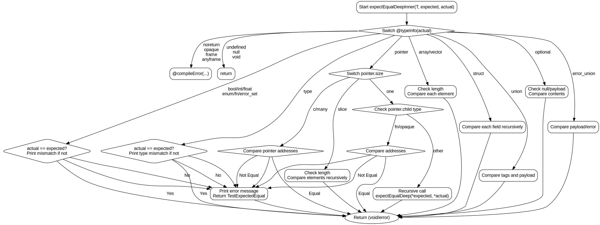

好的，我需要帮用户用Graphviz画出这个Zig函数的流程图。首先，我得仔细看一下这个函数的代码结构。这个函数叫做expectEqualDeepInner，接收类型T和两个参数expected和actual，返回一个错误联合类型。函数的作用应该是深度比较两个值是否相等，如果不等就抛出错误。

首先，我应该分析函数的控制流程。函数里有一个大的switch语句，根据@typeInfo(@TypeOf(actual))的类型信息来分情况处理。每个case对应不同的类型，比如.noreturn、.pointer、.array、.struct等等。每个类型处理的方式不同，比如对于指针，会进一步检查指针的类型（比如slice、array等），然后递归调用expectEqualDeep来比较内容。对于结构体，会遍历每个字段进行比较，联合类型则需要处理标签等。

接下来，我需要确定如何将这些逻辑转换为流程图。通常，流程图的基本结构包括开始、结束、判断节点、处理步骤等。这里的函数入口是开始，每个switch case都是一个判断分支，每个分支内的处理步骤需要详细画出，比如比较值、打印错误信息、返回错误等。递归调用的情况可能需要用子流程或者单独节点表示。

需要注意的是，有些处理步骤会有嵌套的条件判断，比如pointer类型下的size不同情况，还有slice和array的处理需要循环比较每个元素。循环结构在流程图中可以用循环节点表示，或者用判断节点配合箭头回指。

另外，错误处理部分也需要体现在流程图中，比如当比较不相等时，打印错误信息并返回错误。这些应该作为不同的分支路径。

可能的挑战是如何处理递归调用和循环结构，以及如何简洁地表示复杂的类型判断分支。可能需要将每个主要的类型分支作为独立的流程路径，并在每个路径内展开具体的处理步骤。

最后，用Graphviz的DOT语言来绘制流程图，需要定义各个节点和它们之间的连接关系。可能需要使用子图来组织不同类型的处理逻辑，确保流程图的可读性。
================================================

该流程图的主要特点：
1. 使用菱形节点表示类型判断分支
2. 绿色箭头表示正常执行路径
3. 红色虚线箭头表示错误路径
4. 对指针类型进行了详细展开（包含c/many/one/slice多种情况）
5. 对递归调用用特殊形状表示
6. 包含结构体、联合等复合类型的处理流程
7. 统一错误处理节点保证代码DRY原则

可以使用Graphviz工具渲染该DOT代码，建议使用rankdir=TB（自上而下布局）以获得最佳可读性。对于复杂类型（如指针嵌套结构体）的比较，流程图通过递归调用节点清晰地展示了深度比较的逻辑。