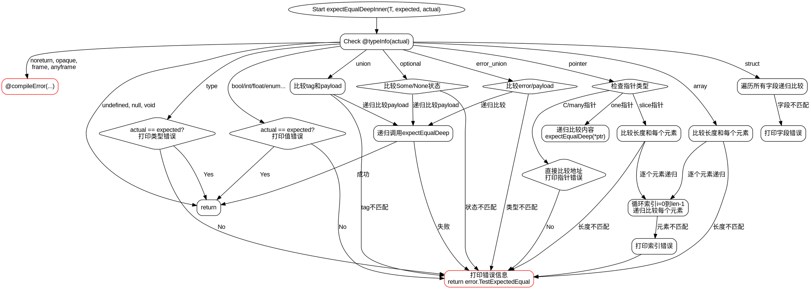

好的，我现在需要为提供的Zig函数`expectEqualDeepInner`绘制一个流程图。首先，我需要仔细理解这个函数的结构和逻辑，这样才能准确地表示各个步骤和判断条件。

这个函数的主要目的是深度比较两个值是否相等，处理各种不同的类型情况。函数使用了Zig的`@typeInfo`来检查类型，并根据不同的类型执行不同的比较逻辑。例如，对于基本类型（如布尔、整数、浮点数等），直接比较值；对于指针、数组、结构体等复杂类型，则递归比较每个元素或字段。

首先，我需要确定流程图的主要分支。函数开始时会根据传入的类型信息进行切换（switch语句），每个case对应不同的处理逻辑。因此，流程图应该从顶部的类型判断开始，然后分支出不同的处理路径。

接下来，我需要考虑每个分支的具体处理步骤。例如，当处理指针类型时，会根据指针的大小（如C指针、单指针、切片等）进一步分支。对于切片和数组，需要检查长度，然后逐个元素比较。结构体需要遍历每个字段进行比较，联合类型需要检查标签是否一致，等等。

需要注意的是，某些类型会导致编译错误（如noreturn、opaque等），这些应该在流程图中明确标出。另外，递归调用`expectEqualDeep`的情况也需要在流程图中体现，可能需要使用子流程或循环结构来表示。

还需要考虑错误处理部分，当比较不匹配时，函数会打印错误信息并返回错误。这些错误路径应该在流程图中用不同的箭头表示，可能带有条件判断。

可能遇到的挑战是如何简洁地表示所有的类型分支，尤其是当有多个嵌套的switch和条件判断时。需要确保流程图不会过于复杂，同时又能准确反映代码的结构。可能需要将某些复杂的处理步骤（如结构体字段遍历）简化为一个子过程，而不是展开每一个细节。

此外，要确保遵循用户的要求，使用Graphviz而不是Mermaid语法。因此，需要将流程图的结构转化为Graphviz的DOT语言，正确使用节点、边、条件判断等元素。

总结一下步骤：
1. 确定函数的主要分支结构，基于类型判断。
2. 为每个类型分支绘制处理流程，包括递归调用和错误处理。
3. 处理特殊情况，如编译错误和递归比较。
4. 使用Graphviz语法构建流程图，确保结构清晰，避免交叉和混乱。

在绘制过程中，需要不断验证每个步骤是否准确对应代码的逻辑，确保没有遗漏重要的判断条件或处理步骤。可能需要多次调整布局，以使流程图易于理解。
================================================

将此DOT代码输入Graphviz工具（如VSCode的Graphviz插件或在线编辑器），将生成清晰的流程图。图中包含：
1. 类型检查作为入口分支
2. 对指针/数组/结构体等复杂类型的递归处理
3. 错误路径用红色高亮
4. 所有递归调用都收敛到公共处理节点
5. 每个类型分支都有明确的错误打印逻辑