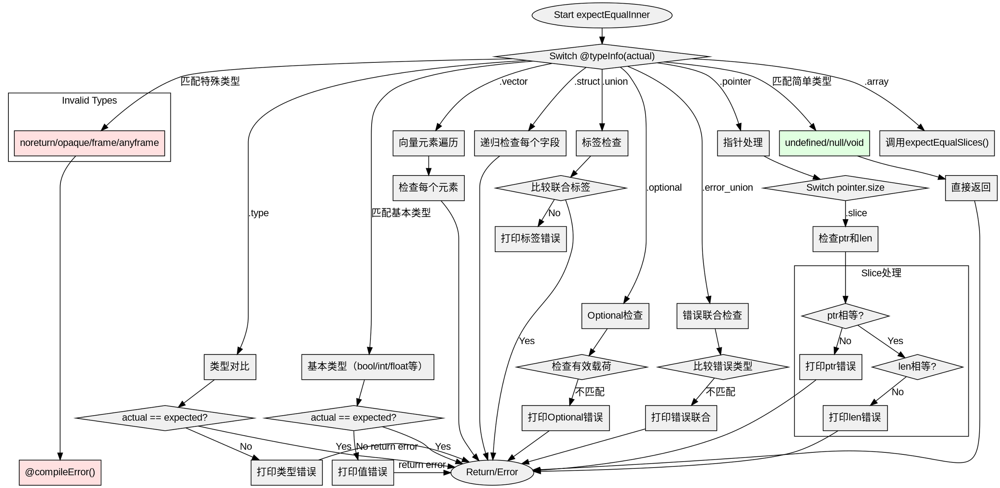

嗯，我需要帮用户把提供的Zig代码中的expectEqualInner函数用Graphviz画成流程图。首先，我得仔细看一下这个函数的代码结构，看看里面有哪些条件分支和循环。函数里有一个大的switch语句，根据不同的类型信息执行不同的操作。每个case处理不同的类型，比如基本类型、指针、数组、结构体等等。

首先，我应该确定主要的流程节点。函数开始于检查@typeInfo(actual)的结果，然后根据不同的类型进入不同的分支。每个分支里可能有进一步的条件判断，比如指针的大小是one、many还是c，或者是slice的情况，处理ptr和len。数组和向量需要遍历元素，结构体需要遍历字段，联合体需要检查标签等等。

接下来，我需要将这些逻辑结构转化为流程图中的节点和边。每个switch的case对应一个决策节点，然后根据不同的情况分支出去。例如，处理指针时，会有子判断指针的size属性，slice的话还要检查ptr和len。对于数组和向量，会有循环遍历元素的步骤，这可能需要用循环节点表示。

需要注意的是，有些case会直接返回，比如undefined、null、void类型，直接return。而其他情况如果有不匹配，就会打印错误信息并返回错误。对于结构体和联合体，可能需要递归调用expectEqual函数，这在流程图中可能需要表示为子流程或者调用另一个节点。

另外，处理可选类型和错误联合时，需要检查是否存在有效载荷，或者是否为null，这也会产生不同的分支。错误处理部分需要生成相应的错误节点。

可能遇到的挑战是如何将复杂的类型判断和递归调用清晰地表现在流程图中，避免过于复杂。需要合理分组，使用子图或者注释来保持可读性。同时，确保所有的条件分支都有正确的流向，比如条件满足时执行什么操作，否则进入下一个条件或结束。

最后，根据Graphviz的语法，用正确的节点、边和标签来描述整个流程。可能需要使用菱形表示判断节点，矩形表示处理步骤，椭圆形表示开始和结束。确保每个分支都有明确的箭头指向下一个节点，并标注条件，比如“是”或“否”。

总结一下，步骤应该是：
1. 确定函数的主要入口和出口。
2. 分解switch语句的各个case为不同的分支。
3. 处理每个case中的子判断和循环。
4. 表示递归调用或子函数调用。
5. 处理错误情况和返回路径。
6. 使用Graphviz语法构建节点和边，确保逻辑清晰。
================================================
