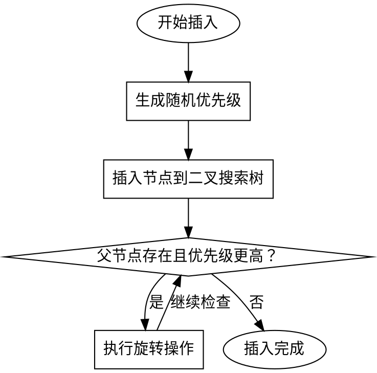
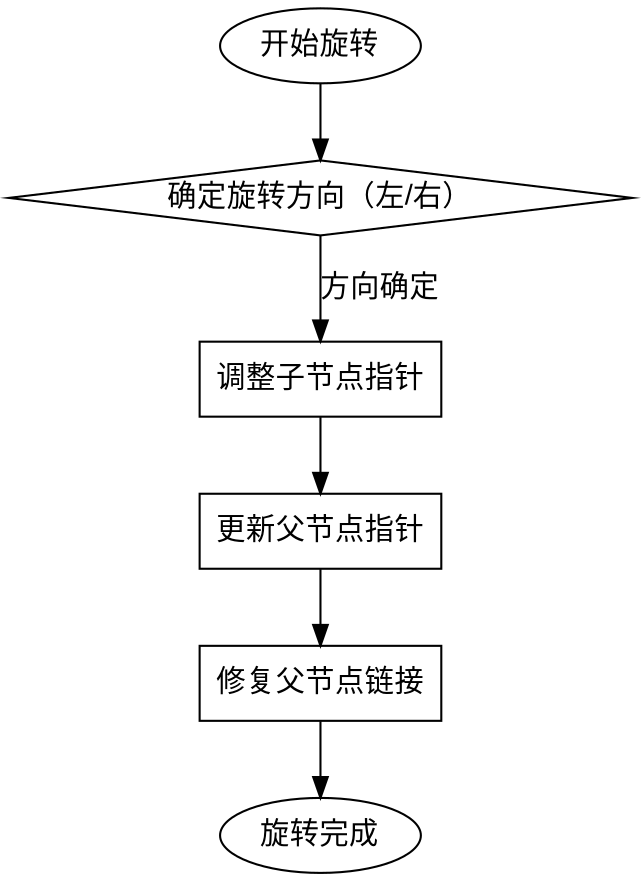
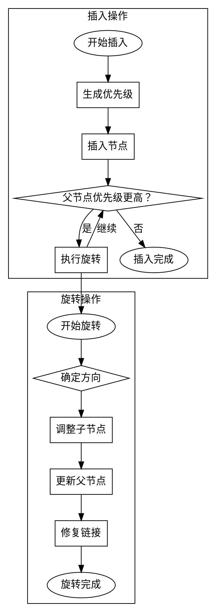

嗯，我需要帮助用户根据提供的Zig代码中的Treap结构生成一个流程图。用户希望使用Graphviz来绘制这个流程图。首先，我需要理解这段代码的结构和各个部分的功能，然后将这些部分转化为流程图中的节点和边。

首先，这段代码定义了一个Treap数据结构，它是一种结合了二叉搜索树和堆的结构。Treap的每个节点有一个键和一个优先级，键满足二叉搜索树的性质，而优先级满足堆的性质。代码中包含了Treap的初始化、节点插入、替换、删除、旋转操作，以及迭代器的实现。

接下来，我需要确定流程图的主要组成部分。通常，流程图的节点代表函数或操作，边表示函数之间的调用关系或流程的顺序。不过，由于这是一个数据结构及其方法的实现，可能需要将每个主要方法作为节点，并展示它们之间的关系。例如，插入节点可能会调用旋转操作，而旋转操作又会影响树的结构。

不过，考虑到用户可能希望的是Treap的结构图，而不仅仅是函数调用流程。因此，可能需要绘制Treap的节点结构，展示父子关系和子节点，以及旋转操作如何改变树的结构。但Graphviz更适合展示结构化的图表，比如树形结构或流程图。

或者，用户可能希望的是代码的流程图，即各个函数之间的执行流程。例如，插入函数的流程：生成优先级、插入节点、旋转调整等步骤。每个步骤作为一个节点，箭头表示顺序。

为了明确，我需要确认用户的需求。但根据问题描述，用户提供的代码是一个Treap的实现，希望用Graphviz画出函数的流程图。因此，可能的理解是希望将Treap的操作流程（如插入、删除、旋转等）以流程图的形式展示。

不过，可能更准确的是，用户希望生成Treap数据结构的类图或结构图，展示各个结构体（如Treap、Node、Entry、Prng等）之间的关系，以及它们的方法。例如，Treap包含Node，Node有父节点和子节点，Entry与Treap和Node关联等。

或者，用户可能希望展示Treap的操作流程，例如插入节点的步骤：查找位置、插入节点、调整优先级通过旋转。每个步骤作为流程图中的一个节点，分支条件决定旋转的方向等。

由于用户提到“函数的流程图”，可能更倾向于后者。例如，insert函数的流程图，展示从开始到结束的各个步骤，包括条件判断和循环。

但需要具体分析代码中的各个函数，并拆解它们的逻辑流程。例如，insert函数的主要步骤是：

1. 生成节点的随机优先级。
2. 将节点插入到正确的位置（根据二叉搜索树的性质）。
3. 通过旋转调整节点位置，以满足堆的优先级性质。

每个步骤可能包含子步骤，比如旋转操作本身也是一个函数，可能需要展开。

然而，Graphviz的流程图更适合线性或分支流程，而不是详细的代码步骤。可能需要将每个函数的主要步骤分解为流程图节点，并用箭头连接它们。

此外，还需要考虑代码中的其他函数，如remove、replace、rotate等，这些函数可能在插入或删除过程中被调用，因此需要在流程图中体现它们之间的关系。

例如，插入节点时，可能会触发多次旋转操作，直到父节点的优先级不大于当前节点的优先级。这涉及到循环结构，需要在流程图中用循环节点表示。

总结来说，流程图的绘制需要涵盖Treap的主要操作函数（insert、remove、replace、rotate），以及它们之间的调用关系和逻辑流程。每个函数的内部步骤需要分解为流程图中的节点，条件判断和循环结构需要用分支和循环节点表示。

现在，我需要将这些步骤转化为Graphviz的DOT语言。例如，开始节点，条件判断节点（如父节点优先级是否大于当前节点），旋转操作节点，循环返回节点等。

可能的流程如下：

对于insert函数：
1. 开始
2. 生成节点优先级
3. 插入节点到二叉搜索树正确位置
4. 检查父节点是否存在且优先级是否大于当前节点
5. 如果是，执行旋转操作
6. 重复步骤4直到条件不满足
7. 结束

每个步骤对应一个节点，条件和循环用箭头和条件标签表示。

同样，rotate函数的流程图需要展示旋转的具体步骤，如确定旋转方向，调整父节点和子节点的指针等。

不过，考虑到代码的复杂性，可能需要为每个主要函数绘制单独的流程图，或者将整个Treap的操作流程综合到一个大的流程图中，但可能会显得复杂。

因此，最终的Graphviz代码可能会包含多个节点和边，表示各个函数及其调用关系，以及条件判断和循环结构。

在编写Graphviz代码时，需要使用不同的形状来表示不同的节点类型，例如矩形表示过程，菱形表示判断，箭头表示流程方向。

例如：

digraph TreapInsert {
    start [label="开始插入", shape=ellipse];
    generate_priority [label="生成节点优先级", shape=rectangle];
    insert_position [label="插入到二叉搜索树正确位置", shape=rectangle];
    check_parent [label="父节点存在且优先级更高？", shape=diamond];
    rotate [label="执行旋转操作", shape=rectangle];
    end [label="结束插入", shape=ellipse];

    start -> generate_priority;
    generate_priority -> insert_position;
    insert_position -> check_parent;
    check_parent -> rotate [label="是"];
    rotate -> check_parent;
    check_parent -> end [label="否"];
}

类似地，为其他函数如remove、rotate等创建子图。

但用户可能需要一个综合的流程图，覆盖所有主要操作。不过，这样可能会非常复杂。因此，可能需要分步骤绘制各个主要函数的流程图，然后将它们组合起来。

由于时间有限，可能需要优先处理主要的insert和rotate函数的流程图，因为它们是最核心的操作。

综上，我将根据代码中的insert函数和rotate函数，绘制它们的流程图，并生成对应的Graphviz DOT代码。
================================================
要绘制Treap的流程图，我们主要关注插入（insert）和旋转（rotate）操作。以下是使用Graphviz的DOT语言表示的流程图：

### 插入操作流程图

### 旋转操作流程图

### 合并流程图（简化版）

### 说明
1. **插入操作**：  
   - 生成节点的随机优先级。  
   - 将节点插入二叉搜索树的正确位置。  
   - 循环检查父节点优先级，若父节点优先级更高，则触发旋转。  
   - 重复旋转直到满足堆性质。  

2. **旋转操作**：  
   - 确定旋转方向（左旋或右旋）。  
   - 调整子节点和父节点的指针。  
   - 更新相关节点的父指针。  

使用Graphviz工具（如在线编辑器或本地工具）渲染上述DOT代码，即可生成对应的流程图。