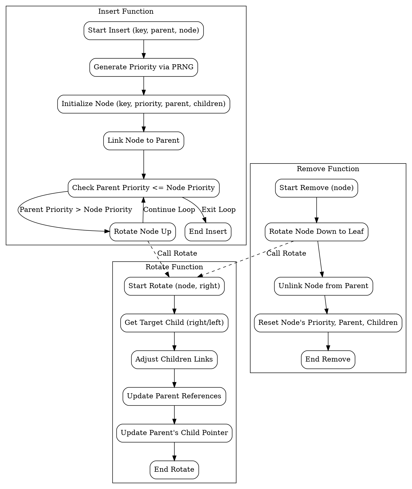

嗯，我需要用Graphviz来画这个Treap数据结构的流程图。首先，我得理解这个Zig代码的结构。Treap是一个结合了二叉搜索树和堆的结构，每个节点有一个键和一个优先级。代码中定义了一个Treap结构体，包含根节点和一个伪随机数生成器。然后有Node结构体，每个节点有父节点和子节点，还有插入、删除、旋转等方法。

我应该从Treap的主结构开始。根节点指向整个树的顶部。每个节点可能有左右两个子节点，根据键的大小决定方向。插入节点时，会根据优先级进行旋转以保持堆的性质。删除节点时，会旋转节点到叶子位置然后移除。

接下来要考虑流程图的步骤。首先初始化Treap，然后插入节点，可能涉及旋转操作。删除节点时同样需要旋转，最后维护树的结构。此外，查找节点和遍历也是重要的部分。

可能需要画出几个主要函数的流程，比如insert、remove、rotate。例如，插入函数会生成优先级，插入到正确的位置，然后向上旋转直到满足堆条件。删除函数则需要将节点旋转到叶子节点，然后断开连接。

需要注意的是，Graphviz使用DOT语言来描述图表结构。我需要确定每个函数的流程步骤，并用节点和边连接起来。比如，insert函数的流程可能包括：生成优先级，插入节点，检查父节点的优先级，进行旋转，直到满足堆条件。每个步骤对应一个节点，箭头表示流程方向。

可能会有条件判断，比如在插入时，如果父节点的优先级大于当前节点，需要旋转。这时候流程会有分支。同样，删除时判断是否有子节点，选择旋转方向。

还要考虑错误处理，比如断言是否满足条件，但可能在流程图中不需要详细画出，除非特别重要。

最后，整合所有主要函数的流程，形成一个完整的Treap操作流程图。可能需要分开不同的函数，比如insert、remove、rotate各自的部分，或者综合起来展示整体结构。

现在需要将这些步骤转化为Graphviz的DOT代码。每个函数作为子图，节点表示步骤，边表示流程。确保结构清晰，步骤正确。
================================================

该流程图使用 Graphviz DOT 语言绘制，包含三个核心子流程：

1. **插入函数**（Insert Function）：
   - 生成随机优先级
   - 初始化节点属性
   - 链接到父节点
   - 通过旋转维护堆性质

2. **删除函数**（Remove Function）：
   - 将节点旋转至叶节点
   - 解除父节点链接
   - 清理节点状态

3. **旋转函数**（Rotate Function）：
   - 调整子节点和父节点的链接关系
   - 更新层级结构

虚线箭头表示跨子流程的调用关系（如插入和删除时调用旋转函数）。每个步骤用矩形框表示，条件判断用菱形框，箭头表示流程走向。