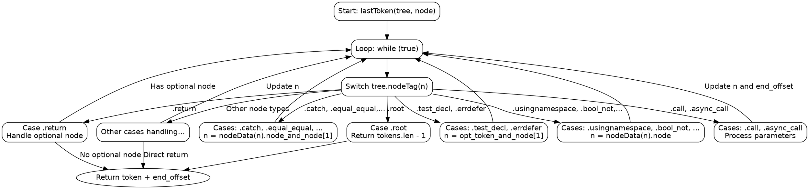

嗯，我现在需要为一个用Zig编写的函数`lastToken`生成一个Graphviz的流程图。首先，我得理解这个函数是做什么的。看起来这个函数是用来遍历抽象语法树（AST）的节点，找到某个节点的最后一个令牌（TokenIndex）。函数内部使用了一个无限循环，根据不同的节点类型（通过`tree.nodeTag(n)`判断）进行不同的处理，可能会递归地访问子节点，直到找到最后一个令牌。

首先，我需要理清整个函数的逻辑结构。函数的主体是一个无限循环`while (true)`，里面有一个大的switch语句，根据不同的节点标签（nodeTag）执行不同的操作。每个case处理不同的AST节点类型，可能修改当前节点`n`或者返回最终的TokenIndex。

为了画流程图，我需要将每个case分支转化为流程图的节点和边。每个case可能会改变当前节点`n`或者直接返回结果。需要注意循环的退出条件，也就是当某个case执行return语句时，流程结束。

接下来，我需要识别主要的控制流结构。例如，当遇到`.root`节点时，直接返回最后一个token。其他情况下，可能会继续循环，设置新的`n`值，或者增加`end_offset`，然后继续循环。还有一些复杂的处理，比如处理函数调用、结构体初始化等，需要访问额外的数据或子节点。

需要注意的是，有些case处理逻辑相似，可以归类处理。例如，很多二元操作符的处理可能都是取第二个子节点。此外，有些case会增加`end_offset`的值，这可能是因为需要计算后续token的位置，比如括号、逗号等符号。

在绘制流程图时，可能需要将每个case作为一个决策节点，然后根据不同的处理逻辑连接到下一个节点或返回。对于循环部分，需要表示循环的持续，直到遇到return语句。

另外，要处理各种可能的节点类型，比如`.call`, `.while`, `.if`等，每个都有不同的处理逻辑。可能需要将这些节点类型分组，根据它们的处理方式，减少重复的图形元素。

最后，需要确保流程图的正确性，覆盖所有可能的case，并正确反映函数中的控制流。可能需要多次检查每个case的处理逻辑，确保边和节点的连接正确无误。
================================================

该流程图展示了以下关键逻辑：

1. 函数入口进入无限循环
2. 通过switch语句处理不同节点类型
3. 主要分为三类处理方式：
   - 直接返回结果（如.root）
   - 修改当前节点n后继续循环
   - 处理复杂结构（如函数调用）后继续循环
4. 使用分组方式表示相似处理逻辑的节点类型
5. 最终通过return_token节点退出循环

复杂节点类型（如.call、.while等）的处理细节通过子流程表示，实际实现时需要根据具体case展开处理逻辑。循环出口统一收敛到return_token节点，体现offset计算和token定位的核心逻辑。