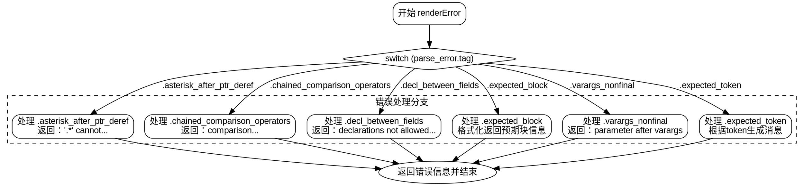

好的，我现在需要帮用户用Graphviz画出Zig函数`renderError`的流程图。首先，我得仔细看看这个函数的结构。这个函数处理各种解析错误，根据不同的错误标签返回相应的错误信息。看起来函数的主体是一个大的switch语句，每个case对应不同的错误类型，然后生成对应的错误消息输出到流里。

首先，我需要理解这个函数的逻辑流程。函数入口是`renderError`，然后根据`parse_error.tag`的不同值进入不同的分支。每个分支可能执行一些操作，比如调用`stream.writeAll`或者`stream.print`，然后返回结果。因为所有的case都有return语句，所以整个函数的结构是一个多分支的选择结构，每个分支处理特定的错误情况，然后结束流程。

接下来，我需要考虑如何用Graphviz来表示这个流程。Graphviz使用DOT语言，通常用节点和边来表示流程。对于这样的switch语句，通常的做法是用一个开始节点，连接到switch的判断节点，然后每个case对应一个分支节点，最后可能有一个结束节点。

不过，由于每个case处理完就直接返回，所以每个分支最终都会指向结束节点，或者直接结束。可能需要简化流程，避免过多的交叉线条，使得图表清晰易读。

可能的步骤：
1. 开始节点：函数开始。
2. 判断节点：根据`parse_error.tag`选择不同的分支。
3. 每个case对应的处理节点，比如`.asterisk_after_ptr_deref`对应的处理，`.chained_comparison_operators`对应的处理，等等。
4. 每个处理节点之后直接指向结束节点，因为return了。

不过，由于有很多case（可能有超过30个），如果每个case都单独画出来，图表会非常庞大，难以阅读。这时候可能需要简化，比如将类似的分组合并，或者用注释说明主要结构，而不是列出每个case。

但用户可能需要详细的流程图，包括所有case。不过这样可能不太现实，因为节点太多。可能需要折中，展示主要结构，比如开始、判断节点、几个示例分支，然后结束，或者用子图来分组错误类型。

或者，采用一个菱形判断节点，然后每个case作为分支，连接到各自的处理节点，再统一连接到结束节点。虽然节点很多，但结构清晰。

另外，注意到有些case的处理逻辑相似，比如调用`stream.print`并传递不同的参数，可以归类。但可能每个case还是需要独立节点。

现在，我需要确保Graphviz的语法正确，不要用mermaid。例如，正确的节点定义和边连接。

可能的Graphviz结构：

digraph {
    start [label="renderError开始"];
    decision [label="parse_error.tag?", shape=diamond];
    start -> decision;

    // 每个case分支
    decision -> case1 [label=".asterisk_after_ptr_deref"];
    case1 [label="返回错误信息：'.*' cannot..."];
    case1 -> end;

    decision -> case2 [label=".chained_comparison_operators"];
    case2 [label="返回错误信息：comparison..."];
    case2 -> end;

    // ...其他类似分支

    end [label="结束"];
}

但这样会有很多节点，导致图表臃肿。可能需要调整，比如将所有处理节点合并为一个节点，用注释说明不同的情况，但这样可能不符合用户的要求。

或者，使用一个大的switch节点，然后每个case作为不同的处理路径，每个路径直接结束。这样可能更简洁，但需要合理布局。

另外，用户可能希望看到所有错误类型都被列出，但实际中可能不现实。所以可能需要简化，或者用注释说明存在多个case。

总结：流程图的结构大致是开始→判断错误类型→处理对应错误→结束。每个错误类型对应一个分支，处理完后直接结束。因此，Graphviz图将包含一个判断节点，连接到各个处理节点，每个处理节点连接到结束节点。

现在，我需要编写具体的DOT代码，注意正确使用节点和边的定义，以及标签。同时，确保不使用mermaid语法，而是纯Graphviz。
================================================

**说明：**
1. 流程图使用 `digraph` 描述，包含**开始节点**、**switch 判断节点**和**结束节点**。
2. `switch_node` 用菱形表示多路分支判断，每个错误类型通过带标签的边连接到对应的处理节点。
3. **错误处理分支**用子图 (`subgraph`) 分组，每个节点代表一个错误类型的处理逻辑（实际实现需补全所有 40+ 错误分支）。
4. 所有错误处理节点最终指向统一的结束节点，表示函数返回。

⚠️ 提示：实际使用时应将注释中的 `// 添加其他case节点...` 替换为完整的错误分支（`.extern_fn_body`, `.invalid_bit_range` 等），结构与此示例完全一致。