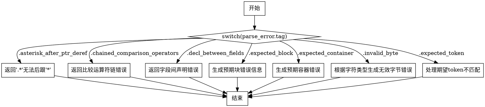

嗯，我现在需要画这个Zig函数的流程图。首先，我得理解这个函数的结构。这个函数叫做renderError，它接受一个Ast树、一个parse_error和一个stream参数，然后根据parse_error的不同标签返回不同的错误信息。看起来主要是用switch语句处理不同的错误情况，每个case里面返回对应的错误信息到stream里。

首先，我应该确定这个函数的主要流程。入口是函数开始，然后进入switch语句，根据parse_error.tag的不同分支执行不同的处理。每个分支可能直接返回一个错误信息，或者做一些处理后再返回。需要注意的是，有些分支使用了stream.print，里面可能调用了其他函数，但这里可能不需要深入到那些函数的内部，只要在流程图中表示出这个分支的输出即可。

接下来，我需要考虑如何将switch的各个分支转化为流程图中的节点。通常，流程图开始于一个开始节点，然后进入判断节点（即switch的判断），然后根据不同的case分支到不同的处理节点，每个处理节点执行相应的操作（如stream.writeAll或stream.print），然后结束或者返回。

但是，这个函数的所有分支都直接返回，所以每个case处理完后就会结束函数。因此，整个流程图的结构应该是：开始 -> switch判断 -> 各个case处理 -> 结束。

不过，由于有多个case分支，可能需要用多个判断节点，但switch在代码中是单次判断，所以应该是一个判断节点分出多个分支。每个分支对应一个case，处理完后都指向结束节点。

不过，流程图中的switch通常用一个菱形判断节点，然后分出多个分支。每个分支对应一个case，执行相应的操作，然后汇聚到结束节点。但这里的每个case都是独立的，执行完后直接返回，所以每个分支的处理节点应该直接指向结束节点，而不是汇聚到一起。

另外，有些case中的处理逻辑比较复杂，比如调用了stream.print，并且传递了一些参数，可能需要将这些参数的处理也表现出来，但为了简化流程图，可能只需要写出主要的操作，比如“返回错误信息：...”。

还有一些case，比如.invalid_byte和.expected_token，它们的处理逻辑更复杂，包含了变量计算和条件判断。这时候可能需要在这些case内部再分支出不同的情况，比如在.invalid_byte中根据不同的字符类型生成不同的错误信息。同样，在.expected_token中，根据found_tag是否为.invalid来生成不同的消息。这时候，这些case内部可能需要进一步的判断节点。

但是，如果流程图过于详细，可能会变得复杂。需要根据需求决定详细程度。用户可能希望一个高层次的流程图，展示主要的处理分支，而不是每个内部细节。

因此，整个流程图的步骤大概是：

1. 开始节点。
2. Switch节点，根据parse_error.tag分支到各个case。
3. 每个case对应的处理节点，比如返回特定错误信息。
4. 结束节点。

对于有内部条件判断的case，比如.invalid_byte和.expected_token，可以在对应的处理节点内部再添加子判断，比如在.invalid_byte中判断字符类型，或者在.expected_token中判断found_tag是否为.invalid。

但是，在graphviz中，如何表示这种嵌套的判断呢？可能需要将这些子判断作为子图来处理，或者用多个菱形节点来表示。

不过，可能更简单的方式是将每个case的处理作为一个单独的节点，即使内部有条件判断，也简化为一个处理步骤，比如“生成错误信息并返回”。这样可以保持流程图的可读性，避免过于复杂。

所以，最终的流程图可能如下：

开始 -> Switch判断 -> 各个错误标签的处理节点 -> 结束。

每个处理节点直接连接到结束节点。

另外，需要注意switch覆盖了所有可能的错误标签吗？在代码中，所有可能的错误标签都被处理了吗？如果有default情况，可能也需要表示出来。但根据代码，没有default分支，因此可能所有可能的错误标签都被显式处理了，所以不需要default分支。

现在，我需要将这些结构用graphviz的语法表示出来。可能需要使用子图来将switch的各个case组织起来，或者用多个节点连接。

例如：

digraph renderError {
    start [label="开始"];
    switch_node [label="switch(parse_error.tag)", shape=diamond];
    end [label="结束"];

    start -> switch_node;

    // 每个case分支
    switch_node -> asterisk_after_ptr_deref [label=".asterisk_after_ptr_deref"];
    asterisk_after_ptr_deref [label="返回'.*' cannot..."];
    asterisk_after_ptr_deref -> end;

    switch_node -> chained_comparison_operators [label=".chained_comparison_operators"];
    chained_comparison_operators [label="返回比较运算符链错误"];
    chained_comparison_operators -> end;

    // ... 其他case类似处理

    // 处理复杂的case，如invalid_byte
    switch_node -> invalid_byte [label=".invalid_byte"];
    invalid_byte [label="生成无效字节的错误信息"];
    invalid_byte -> end;

    switch_node -> expected_token [label=".expected_token"];
    expected_token [label="处理expected_token错误"];
    expected_token -> end;

    // 其他所有case类似连接
}

不过，这样的方式会导致有很多分支，每个case都需要一个节点和连接线。如果有几十个case，这样的图可能会非常庞大。但用户可能希望看到所有主要分支的表示，或者只是结构性的概览。

或者，可以将所有case的处理节点放在一个子图中，用注释表示，但实际graphviz中可能不太方便。另一种方式是使用节点分组，但可能会影响可读性。

考虑到代码中的错误标签数量较多，可能需要简化流程图，只展示几个代表性的case，并在图中用省略号表示其他情况。但根据用户提供的完整代码，可能需要尽可能覆盖所有case。

不过，用户可能希望得到一个完整的流程图，尽管节点很多。因此，可能需要为每个case创建一个处理节点，并连接到结束节点。

但这样生成的图可能过于庞大，不太实用。因此，可能需要使用集群（cluster）来组织不同的错误类型，或者按错误类型分组，但依然难以处理。

另一种可能的策略是将所有返回错误信息的case视为同一类节点，只是标签不同，而将内部有条件判断的case（如invalid_byte和expected_token）单独处理。

例如：

digraph renderError {
    rankdir=TB;
    node [shape=rectangle];

    start [label="开始"];
    switch_node [label="解析错误类型", shape=diamond];
    end [label="结束"];

    start -> switch_node;

    // 简单错误处理节点
    subgraph cluster_simple {
        label="简单错误信息";
        asterisk_after_ptr_deref [label="返回'.*' cannot..."];
        chained_comparison_operators [label="返回比较链错误"];
        decl_between_fields [label="返回不允许的声明"];
        // ... 其他简单case
    }

    // 复杂错误处理节点
    subgraph cluster_complex {
        label="复杂错误处理";
        invalid_byte [label="处理无效字节"];
        expected_token [label="处理期望的token"];
        // ... 其他复杂case
    }

    // 连接switch到各个节点
    switch_node -> asterisk_after_ptr_deref [label=".asterisk_after_ptr_deref"];
    asterisk_after_ptr_deref -> end;

    switch_node -> chained_comparison_operators [label=".chained_comparison_operators"];
    chained_comparison_operators -> end;

    // 其他简单case连接

    switch_node -> invalid_byte [label=".invalid_byte"];
    invalid_byte -> end;

    switch_node -> expected_token [label=".expected_token"];
    expected_token -> end;

    // ... 其他复杂case连接
}

这样，流程图将错误处理分为简单和复杂两类，但需要为每个case创建单独的节点。这可能仍然导致节点数量过多，但至少结构更清晰。

另外，对于每个处理节点，可能需要更详细的标签，例如显示具体的错误信息或处理步骤。例如，invalid_byte节点可以显示“根据字符类型生成错误信息”。

但为了保持简洁，可能只需要用简短的描述，如“处理无效字节错误”。

总结，最终的流程图应该包含：

1. 开始节点。
2. switch判断节点，分支到各个错误标签。
3. 每个错误标签对应的处理节点。
4. 所有处理节点连接到结束节点。

在graphviz中，这需要为每个case创建一个处理节点，并用箭头从switch节点指向处理节点，再指向结束节点。但考虑到代码中有近50个错误标签，这样的流程图会非常庞大，可能不太现实。因此，可能需要使用折叠的方式，或者仅展示部分代表性的case，但用户可能希望看到完整的结构。

因此，最终的graphviz代码将包含所有case的处理节点，每个节点连接到结束节点。虽然节点很多，但这是准确的表示。
================================================

**说明：**
1. **开始节点** 进入 `switch(parse_error.tag)` 判断。
2. **Switch节点** 根据不同的错误标签分发到对应的处理分支。
3. **每个分支节点** 执行特定错误信息生成（如`.asterisk_after_ptr_deref`返回固定字符串，`.invalid_byte`动态生成消息）。
4. **所有分支** 最终流向统一的结束节点。

⚠️ 注：实际代码包含近50个错误分支，此处仅展示部分关键节点，完整流程图需为每个`parse_error.tag`添加对应的处理节点和连接线。