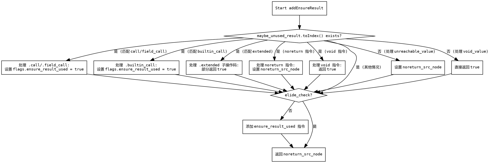

好的，我需要为给定的Zig函数`addEnsureResult`生成一个流程图。首先，我需要仔细阅读并理解这个函数的逻辑，然后将其分解成不同的步骤和条件分支，以便正确地绘制流程图。

函数`addEnsureResult`的主要逻辑似乎是处理ZIR指令，根据不同的指令类型决定是否添加`ensure_result_used`指令。函数首先检查`maybe_unused_result`是否为有效的索引，如果是，则根据不同的ZIR指令标签（tag）进行处理。某些指令需要设置标志来确保结果被使用，而其他指令可能直接返回或处理错误情况。如果`elide_check`为false，则需要添加`.ensure_result_used`指令。

首先，我需要确定函数的主要分支点：

1. 检查`maybe_unused_result.toIndex()`是否存在。如果存在，进入处理各种ZIR标签的switch语句。
   - 对于`.call`, `.field_call`, `.builtin_call`，设置相应的标志并返回`true`。
   - 对于多个其他ZIR指令，根据其类型决定是否跳过检查（返回`false`）。
   - 处理`.extended`指令的子操作码，部分返回`true`。
   - 处理总是`noreturn`或`void`的指令，设置`noreturn_src_node`或直接返回`true`。
2. 如果`maybe_unused_result.toIndex()`不存在，处理`.none`、`.unreachable_value`、`.void_value`等情况。
3. 最后，根据`elide_check`的值决定是否添加`.ensure_result_used`指令。

接下来，我需要将这些逻辑步骤转化为流程图中的节点和判断条件。需要注意的是，Graphviz使用DOT语言来描述图表结构，因此需要定义各个节点和它们之间的连接关系，包括条件分支。

可能的节点包括：

- 开始节点：函数入口。
- 判断`maybe_unused_result.toIndex()`是否存在。
  - 存在：进入ZIR标签的switch处理。
  - 不存在：处理其他情况（如`.unreachable_value`等）。
- 处理不同ZIR标签的分支，设置`elide_check`的值。
- 判断`elide_check`是否为真，决定是否添加指令。
- 返回`noreturn_src_node`。

需要注意循环和递归的情况，但在这个函数中似乎没有明显的循环，主要是条件判断。此外，要确保所有可能的路径都被覆盖，特别是switch中的各个case。

在绘制流程图时，可能需要将复杂的switch结构简化为几个主要分支，以避免图表过于复杂。例如，可以将处理不同ZIR标签的部分合并为几个关键分支，如“设置标志”、“跳过检查”、“处理noreturn/void”等。

最后，确保流程图的箭头正确反映函数的执行流程，包括条件判断后的不同路径，以及最终的返回步骤。
================================================
