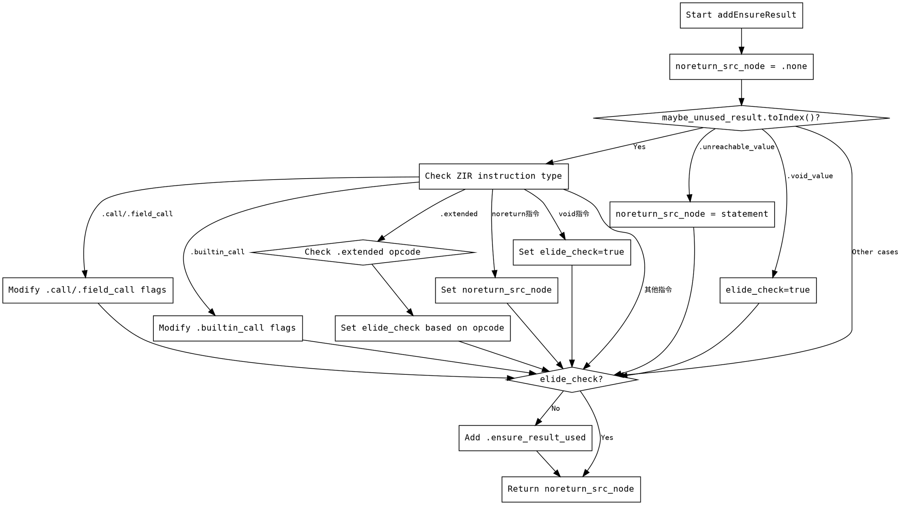

嗯，我需要为这个Zig函数`addEnsureResult`画一个流程图。首先，我得理解这个函数的结构和逻辑流程。看起来这个函数处理的是确保某个结果被使用，可能涉及到不同的ZIR指令的情况。

首先，函数参数是`gz`指针、`maybe_unused_result`和一个`statement`节点索引。返回类型是`Ast.Node.OptionalIndex`。函数内部有一个变量`noreturn_src_node`初始化为`.none`，还有一个`elide_check`的条件判断，根据`maybe_unused_result`是否为索引来决定进入不同的分支。

接下来，如果`maybe_unused_result`有索引，就会进入一个循环，检查对应的ZIR指令类型。不同的指令类型会有不同的处理，比如修改ZIR数据中的标志位，或者设置`elide_check`为true或false。这里有很多的指令类型需要处理，比如`.call`、`.field_call`、`.builtin_call`等等，每个可能影响`elide_check`的值。

如果`maybe_unused_result`没有索引，会进入另一个分支，处理`.none`、`.unreachable_value`和`.void_value`等情况。然后根据`elide_check`的值决定是否添加`.ensure_result_used`指令。

最后，函数返回`noreturn_src_node`。整个流程涉及到大量的条件判断和分支，特别是对不同ZIR指令的处理。

为了画流程图，我需要将主要的判断和分支结构拆解出来。可能的步骤包括：

1. 开始函数。
2. 初始化`noreturn_src_node`。
3. 检查`maybe_unused_result`是否为索引：
   - 是：进入ZIR指令类型判断，处理不同的指令，设置`elide_check`和可能的`noreturn_src_node`。
   - 否：检查`maybe_unused_result`的枚举值，设置`elide_check`。
4. 根据`elide_check`的值决定是否添加`ensure_result_used`指令。
5. 返回结果。

需要注意处理不同指令类型时的分支，尤其是那些会导致`elide_check`为true或false的情况。此外，`.extended`指令需要进一步判断操作码，而某些指令如`@"break"`等会设置`noreturn_src_node`。

可能的结构图会有多个条件分支，尤其是处理各种ZIR指令的部分，可能需要用多个菱形判断框来表示。最终的流程图应该清晰地展示各个判断路径以及对应的处理逻辑。
================================================
