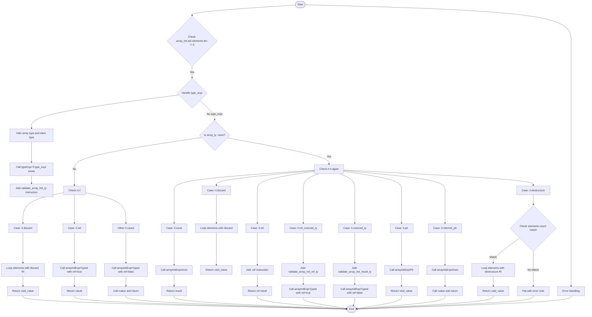

好的，我需要为给定的Zig函数`arrayInitExpr`绘制一个流程图。首先，我需要理解这个函数的结构和逻辑。

首先，函数处理数组初始化表达式。它接收一些参数，包括生成ZIR的上下文、作用域、结果信息、AST节点和数组初始化结构。函数返回一个ZIR指令引用或错误。

接下来，我注意到函数开始于检查数组初始化是否有元素，否则会断言失败。然后处理类型表达式，根据是否存在类型表达式决定数组类型和元素类型。这里有一个`inst`块，可能处理不同类型的数组初始化，比如带有哨兵值或普通数组类型。

然后，根据`array_ty`是否为`.none`，函数分为不同的逻辑分支。如果`array_ty`不为空，处理不同类型的返回位置（如discard、ref、其他情况），可能调用`arrayInitExprTyped`或处理元素类型。如果`array_ty`为空，则根据结果信息的不同情况（如none、discard、ref等），处理匿名初始化、引用、类型强制转换等。

在处理每个分支时，需要注意到不同的`ResultInfo`类型（如rl.discard、rl.ref、rl.ptr等），每个分支有不同的处理逻辑，比如循环处理元素、生成引用、验证类型等。

最后，函数可能返回不同的ZIR指令，如void_value、生成的数组实例，或者在错误时返回错误。

为了绘制流程图，我需要将每个主要判断和分支转化为流程图的节点和判断框。主要的判断点包括：

1. 是否存在类型表达式（决定array_ty和elem_ty）。
2. array_ty是否不为.none。
3. 不同的ResultInfo情况（rl的类型）。

每个判断点后的处理步骤需要分解为不同的流程路径。例如，当array_ty不为.none时，根据rl的不同处理discard、ref或其他情况；当array_ty为.none时，处理不同的rl情况，如none、discard、ref等。

需要确保所有可能的执行路径都被覆盖，包括错误处理和返回语句。同时，注意循环处理数组元素的步骤，例如在discard情况下遍历所有元素进行表达式处理。

最后，将整个流程整理成流程图的结构，使用开始和结束节点，判断节点（菱形），处理步骤（矩形），以及箭头表示流程方向。
================================================
