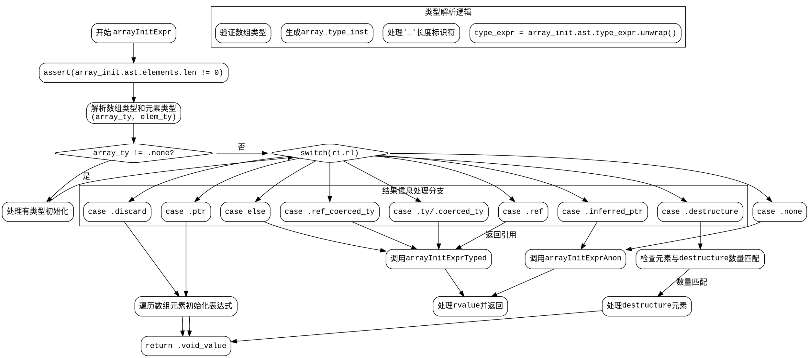

好的，我需要为提供的Zig函数`arrayInitExpr`绘制一个流程图。首先，我需要理解这个函数的结构和逻辑流程，这样才能准确地将其转化为图形表示。

首先，我会通读代码，了解函数的主要步骤。函数`arrayInitExpr`处理数组初始化表达式，根据不同的情况生成相应的ZIR指令。函数开始于检查数组初始化元素是否非空，然后处理类型表达式，确定数组类型和元素类型。接着，根据不同的结果信息（`ri.rl`）处理不同的情况，比如丢弃结果、引用、类型转换等。

接下来，我需要识别函数中的各个分支和循环结构。例如，函数中有多个`switch`语句，尤其是处理`ri.rl`的不同情况，这会导致多个分支路径。同时，循环结构如`for`循环遍历数组元素也需要在流程图中体现。

在绘制流程图时，我需要确保每个条件判断（如`if`和`switch`）都有对应的决策节点，每个分支路径清晰。此外，函数中的递归调用（如调用`expr`或`arrayInitExprTyped`）也需要在流程图中表示，可能使用子流程或单独的处理块。

需要注意的是，代码中存在多个返回点（如`return .void_value;`或`return arrayInitExprTyped(...);`），这些需要在流程图中明确标出。同时，错误处理（如`try`表达式）可能涉及异常流程，但根据代码结构，似乎错误通过返回`InnerError`处理，因此可能不需要单独的异常路径，除非有显式的错误处理节点。

最后，我需要将所有这些元素组织成一个连贯的流程图，使用Graphviz的DOT语言来描述。确保节点之间的箭头正确反映控制流，每个处理步骤和条件判断都准确无误。
================================================
