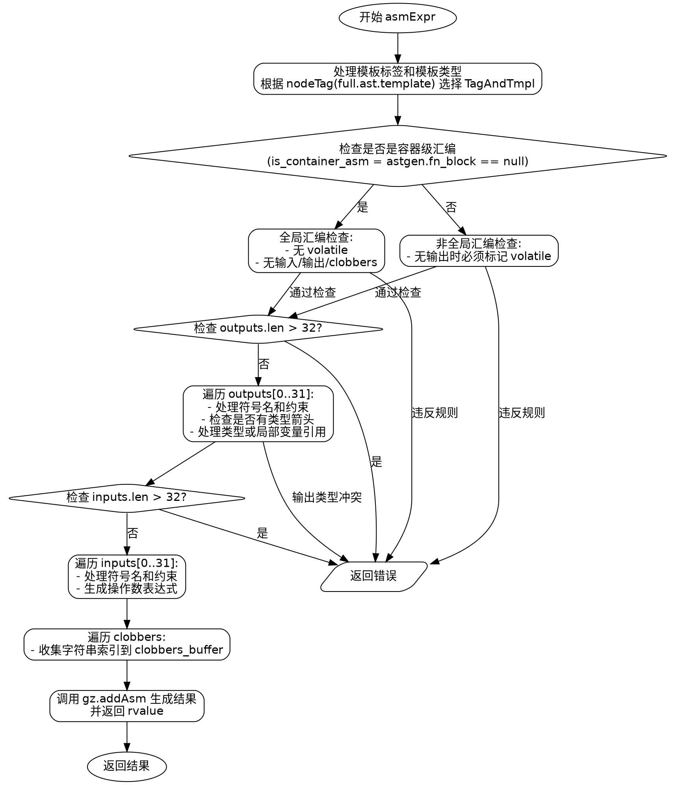

好，我需要为这个Zig函数`asmExpr`生成一个流程图。首先，我需要理解这个函数的结构和逻辑流程。

首先，函数`asmExpr`处理内联汇编表达式。它接收一些参数，包括GenZir指针、作用域、结果信息、节点和完整的Asm结构。函数返回一个Zir指令引用或错误。

接下来，函数开始处理模板，根据不同的节点标签（字符串字面量、多行字符串字面量或其他情况）确定标签和模板。这里有一个结构体`TagAndTmpl`用来存储标签和模板信息。

然后，检查是否是容器级别的汇编（即全局汇编）。如果是，检查是否有volatile标记或输入输出，这些在全局汇编中不允许。如果不是容器级别，检查是否有输出或volatile标记，确保没有输出的情况下必须标记为volatile。

接下来，处理输出部分。遍历所有输出节点，检查每个输出的约束和类型。这里有限制最多32个输出。对于每个输出，处理符号名称、约束，并确定是否有箭头（类型指定）。如果有类型指定，记录到output_type_bits中，并处理类型表达式；否则处理本地变量引用。

然后是输入部分，同样最多32个输入。处理每个输入的符号名称、约束和操作数表达式。

之后处理clobbers（被破坏的寄存器列表）。遍历所有clobber标记，收集到clobbers_buffer中，直到遇到右括号或逗号结束。

最后，使用`gz.addAsm`生成汇编指令的结果，并返回结果。

现在，我需要将这些步骤转化为流程图。流程图应包含开始、各个条件判断（如模板类型判断、容器汇编检查、输出输入数量检查等）、循环处理输出、输入和clobbers，以及最终生成结果。

需要注意各个条件分支，例如不同的模板类型处理，全局汇编与局部汇编的不同检查，输出和输入的处理循环，以及错误处理的情况（如返回错误信息）。

可能的结构如下：

1. 开始
2. 处理模板标签和模板类型
3. 检查是否为容器汇编
   - 是：检查volatile和输入输出是否为空
   - 否：检查是否有输出或volatile
4. 处理输出
   - 检查数量是否超过32
   - 遍历每个输出节点，处理约束和类型
5. 处理输入
   - 同样检查数量
   - 遍历处理每个输入
6. 处理clobbers
   - 遍历收集clobber标记
7. 生成汇编指令结果
8. 返回结果

每个步骤中的错误处理需要作为条件分支，例如数量超过限制时返回错误，无效的volatile使用等。

需要将这些步骤用graphviz的节点和箭头表示，使用条件判断的分支，循环处理部分可以用流程块表示，比如循环处理每个输出、输入等。

确保流程图中的每个判断点都正确连接，例如模板类型判断的三个分支，容器汇编的是/否分支，输出数量是否超过限制的判断等。

最后，将整个流程整理成graphviz的语法，使用正确的节点形状（如菱形表示判断，矩形表示处理步骤，椭圆形表示开始和结束）。
================================================
