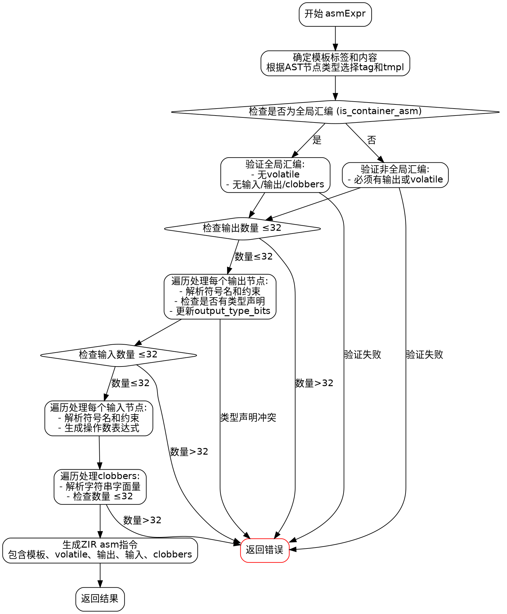

好的，我需要为提供的Zig函数`asmExpr`绘制流程图。首先，我需要理解这个函数的结构和逻辑。

函数`asmExpr`处理内联汇编表达式，生成对应的ZIR指令。它接受多个参数，包括生成器`gz`、作用域`scope`、结果信息`ri`、AST节点`node`和完整的汇编表达式`full`。函数返回一个ZIR指令的引用或错误。

首先，函数确定汇编模板的标签和模板内容，根据不同的AST节点类型（字符串字面量、多行字符串或其他情况）。然后，检查是否为全局汇编（不在函数块内），并进行相关验证，比如是否有无效的`volatile`修饰符，或者输入输出是否合法。

接下来，处理输出部分，遍历所有输出节点，解析符号名称、约束条件，并处理可能的类型声明。这里有一个输出类型位掩码`output_type_bits`来跟踪是否有类型声明。

然后处理输入部分，类似输出，解析每个输入的符号名、约束和操作数。

之后处理clobbers（被修改的寄存器列表），解析每个clobber并检查数量是否超限。

最后，生成ZIR的`asm`指令，并返回结果。

流程图需要涵盖这些主要步骤，包括条件判断（如是否为全局汇编、输出输入数量限制等）、循环处理输出、输入和clobbers，以及错误处理。

可能的节点包括：

1. 开始
2. 确定模板标签和内容
3. 检查全局汇编并验证
4. 处理输出部分（循环）
5. 处理输入部分（循环）
6. 处理clobbers（循环）
7. 生成ZIR指令
8. 返回结果
9. 错误处理节点

需要注意条件分支，比如根据`is_container_asm`的不同处理路径，输出和输入数量是否超过限制时的错误返回，以及循环中的处理流程。

需要确保每个判断点都有正确的分支，例如当`full.volatile_token`存在时的错误，或者输出数量超过32时的错误处理。

可能的结构图：

开始 → 确定标签和模板 → 检查全局汇编 → 是 → 验证无输入输出 → 处理输出 → 处理输入 → 处理clobbers → 生成指令 → 返回结果

检查全局汇编 → 否 → 验证必须有输出或volatile → 处理输出 → ...（后续步骤）

在处理输出时，循环每个输出节点，检查是否有箭头（类型声明），更新`output_type_bits`，处理类型或变量引用。

类似地，输入和clobbers的循环处理。

错误处理节点可能出现在各个验证步骤，如数量超过限制、无效的volatile使用等，直接指向错误返回。

需要将所有这些步骤和条件用流程图符号（菱形判断框、矩形处理框、箭头连接）表示出来，确保逻辑正确。
================================================
