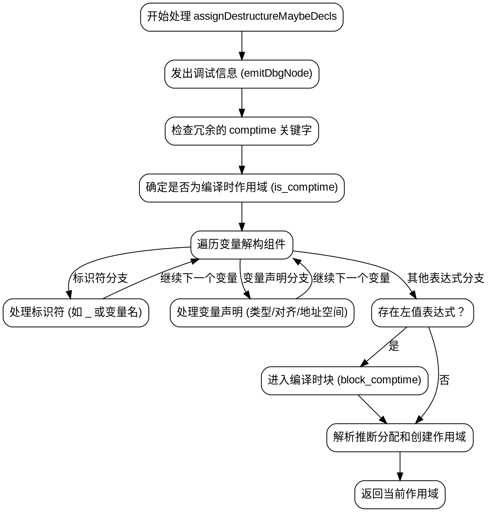

好的，我需要为给定的Zig函数`assignDestructureMaybeDecls`绘制一个流程图。首先，我要理解这个函数的结构和逻辑流程。

函数开始于处理节点的调试信息，然后获取AST（抽象语法树）信息。检查是否有冗余的`comptime`关键字，并确定作用域是否为编译时。接下来处理变量解构，包括标识符、变量声明等。对于每个变量，处理可能的类型、对齐、地址空间等，并生成相应的ZIR指令。然后处理编译时块，处理左值表达式，最后处理作用域和变量声明，包括解决推断的分配和创建新的作用域。

我需要将这一流程分解为主要的步骤，并用Graphviz的DOT语言表示出来。每个步骤应该是一个节点，箭头表示流程方向。需要注意条件判断（如`if`语句）和循环（如`for`循环）的分支。

可能的步骤包括：
1. 开始处理节点，发出调试信息。
2. 检查冗余的`comptime`关键字。
3. 确定是否为编译时作用域。
4. 处理变量解构的每个组件：
   a. 标识符处理。
   b. 变量声明处理（类型、对齐等）。
   c. 处理左值表达式。
5. 处理编译时块。
6. 处理推断分配和创建作用域。

需要注意条件分支，例如是否存在`comptime_token`，是否有左值表达式等。循环处理每个变量组件时，可能需要分支到不同的处理路径。

现在将这些步骤转化为Graphviz的流程图。使用不同的节点形状表示开始/结束、处理步骤、条件判断等。确保逻辑清晰，流程正确。
================================================
