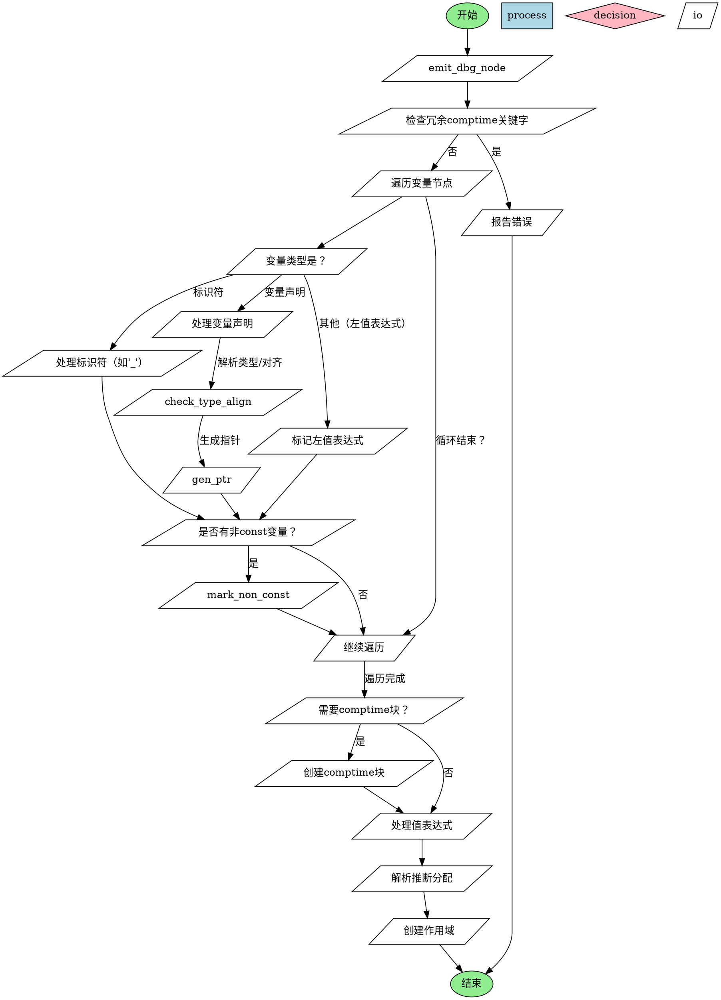

好的，我现在需要为提供的Zig函数`assignDestructureMaybeDecls`绘制流程图。首先，我需要理解这个函数的功能和结构。

函数`assignDestructureMaybeDecls`处理解构赋值声明，可能涉及变量声明和作用域管理。从代码中可以看出，函数处理了多个情况，如标识符、变量声明（包括全局、局部、简单、带对齐的变量声明）等，并根据是否为编译时（comptime）进行不同的处理。

首先，我需要分解函数的步骤：

1. **初始处理**：调用`emitDbgNode`，获取AST和树结构，检查是否有冗余的`comptime`关键字。
2. **处理解构赋值**：遍历每个变量节点，确定是否为标识符或变量声明，处理`comptime`和`const`的情况。
3. **处理变量声明**：对于每个变量声明，处理类型、对齐、地址空间等，生成相应的指针或推断类型。
4. **处理左值表达式**：如果有左值表达式，生成相应的指令。
5. **处理编译时块**：如果存在`comptime`标记，创建编译时块，处理其中的指令。
6. **解析推断分配和常量指针**：处理推断类型的分配，将指针设为常量（如需要）。
7. **创建作用域**：检测变量遮蔽（shadowing），创建新的作用域，并添加到当前作用域链中。

接下来，我需要将这些步骤转化为流程图中的节点和分支。可能的节点包括：

- 开始
- 检查comptime冗余
- 遍历变量节点
- 处理标识符或变量声明
- 处理类型和对齐
- 生成指针
- 检查左值表达式
- 创建编译时块
- 解析推断分配
- 创建作用域
- 结束

每个步骤之间需要根据条件判断进行分支，例如变量节点的类型（标识符、变量声明等）、是否为编译时、是否存在左值表达式等。

需要注意的是，代码中有多个循环（如遍历`rl_components`和`full.ast.variables`），需要正确表示循环结构。此外，条件判断如`if (full.comptime_token != null)`、`if (any_lvalue_expr)`等也会产生分支。

在绘制流程图时，应使用不同的形状表示不同的节点类型，例如：

- 椭圆：开始和结束
- 矩形：处理步骤
- 菱形：条件判断
- 平行四边形：输入/输出

此外，需要确保流程图的逻辑顺序正确，特别是循环和条件分支的位置。

可能的挑战在于正确表达循环结构和嵌套的条件判断，尤其是在处理变量节点时的多重判断和后续的处理步骤。需要仔细分析代码中的控制流，确保每个分支都被正确表示。

最后，生成Graphviz代码时，要注意节点的命名和连接，避免循环引用或遗漏步骤。可能需要多次迭代调整，以确保流程图准确反映函数的执行流程。
================================================
