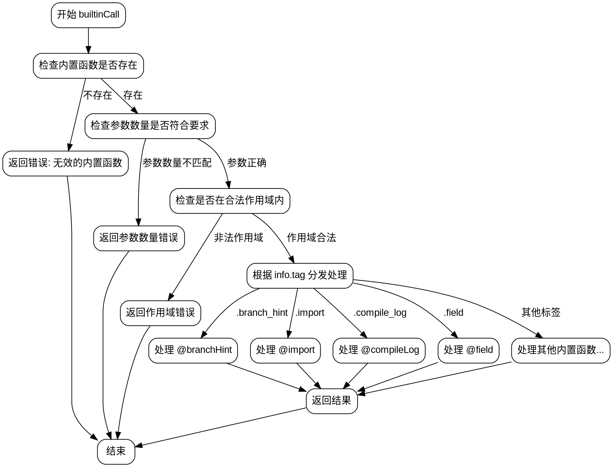

好的，我现在需要为给定的Zig代码中的`builtinCall`函数绘制一个流程图。首先，我需要理解这个函数的结构和逻辑流程。让我仔细阅读代码，看看它的各个部分是如何工作的。

函数`builtinCall`似乎负责处理Zig语言中的内置函数调用。它接受多个参数，包括生成ZIR的上下文、作用域、结果信息、AST节点等。函数内部首先获取AST树和内置函数名，然后根据不同的内置函数执行不同的操作。

首先，函数会检查内置函数是否存在，如果不存在则返回错误。接着，验证参数数量是否符合预期。然后检查某些内置函数是否在函数作用域外非法使用。随后，使用一个大的`switch`语句根据内置函数的标签处理不同的情况，每个标签对应不同的处理逻辑，比如生成特定的ZIR指令、处理参数、返回结果等。

为了绘制流程图，我需要将这个过程分解为主要的步骤和分支。可能的步骤如下：

1. **开始**：函数入口。
2. **获取内置函数信息**：通过内置函数名查找信息，如果不存在则报错。
3. **验证参数数量**：检查参数数量是否符合预期，不符合则报错。
4. **检查作用域限制**：某些内置函数只能在函数作用域内使用，否则报错。
5. **处理不同内置函数**：根据`info.tag`进入不同的处理分支，每个分支可能有不同的逻辑，比如处理参数、生成指令、返回结果等。
6. **返回结果**：根据处理结果返回相应的ZIR指令引用。

每个内置函数的处理分支（如`.branch_hint`、`.import`等）会有不同的子流程，但由于种类繁多，可能需要将这些分支简化为一个统一的步骤，或者在流程图中用一个大分支表示，再进一步展开主要的分支。

考虑到代码中使用了一个庞大的`switch`语句，每个case处理不同的内置函数，流程图需要展示这个主要的switch结构，并可能对某些重要的case进行详细展开，而其他case可以合并处理。

需要注意的复杂点包括错误处理、参数验证、以及不同内置函数生成不同ZIR指令的逻辑。同时，函数中有许多返回点，需要正确表示每个可能的退出路径。

可能的流程图结构：

- 开始节点
- 获取内置函数名和检查是否存在，不存在则报错
- 检查参数数量是否正确，错误则报错
- 检查作用域限制，错误则报错
- 进入switch分支处理各个内置函数
  - 每个主要的case（如.branch_hint, .import等）作为一个分支节点
  - 每个分支内部的处理步骤，如参数处理、生成指令等
  - 最终返回结果或错误
- 结束节点

由于内置函数处理分支众多，可能需要将一些常见的处理模式归类，例如参数验证、生成特定指令、返回结果等，以便简化流程图。同时，可以重点展开几个关键的内置函数处理流程，其余用概括性的节点表示。

需要确保流程图的连贯性，正确表示函数从开始到结束的所有可能路径，包括错误路径。每个判断节点（如参数检查、作用域检查）应有两条分支：通过和失败，失败直接报错返回。

此外，代码中有许多辅助函数调用，如`expr`、`comptimeExpr`、`rvalue`等，这些可能在流程图中表示为子流程或步骤，但不需要展开其内部细节，除非对理解主流程至关重要。

综上所述，流程图应大致分为以下几个部分：

1. 初始化和基本信息获取。
2. 错误检查（内置函数存在性、参数数量、作用域）。
3. 根据内置函数类型分发处理。
4. 各个处理分支生成相应的ZIR指令。
5. 返回结果或错误。

接下来，将这些步骤转化为Graphviz的节点和边，注意条件判断的分支和各个处理流程的连接。
================================================
