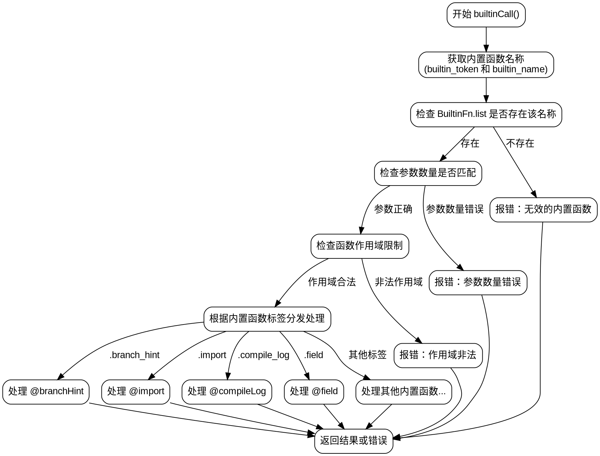

嗯，我需要为这个Zig函数画一个流程图。首先，我得仔细看看这个函数的结构。函数名是builtinCall，看起来是处理内置函数调用的。函数参数包括GenZir指针、作用域、结果信息、节点、参数列表等。函数返回一个Zir指令的引用或者错误。

首先，函数开始获取astgen和tree，然后获取内置函数的名称。接着检查是否在BuiltinFn.list中存在这个内置函数，如果不存在就报错。然后检查参数数量是否正确，如果有参数数量限制的话。之后检查是否在函数作用域外使用了只能在函数内使用的内置函数。

接下来是一个大的switch语句，根据不同的内置函数标签执行不同的处理逻辑。比如处理@branchHint、@import、@compileLog、@field等等。每个case处理不同的内置函数，生成对应的ZIR指令。

我需要将这个过程转化为流程图。流程图的开始应该是函数的入口，然后按顺序处理各个步骤：获取内置函数名称、检查是否存在、检查参数数量、检查作用域合法性，然后根据不同的标签分发到不同的处理分支。每个分支处理完后返回结果或错误。

需要注意各个条件判断的分支，比如参数数量是否正确、是否在合法作用域内，以及每个内置函数的具体处理逻辑。可能有些分支会直接返回错误，有些会生成不同的ZIR指令，最后返回结果。

可能的结构是：

开始 → 获取内置函数名称 → 检查是否存在 → 不存在则报错 → 存在则检查参数数量 → 参数错误则报错 → 检查作用域 → 非法作用域则报错 → 根据标签分发到不同处理分支 → 处理分支生成对应ZIR → 返回结果。

每个内置函数标签的处理可能需要不同的子流程，比如@import需要检查参数是否为字符串字面量，处理路径等。不过对于流程图来说，可能需要将这些细节简化为一个处理块，否则图会太复杂。

因此，总体结构是一个主流程，包含条件判断和分发到各个子流程，每个子流程处理特定的内置函数，最后返回结果或错误。
================================================
