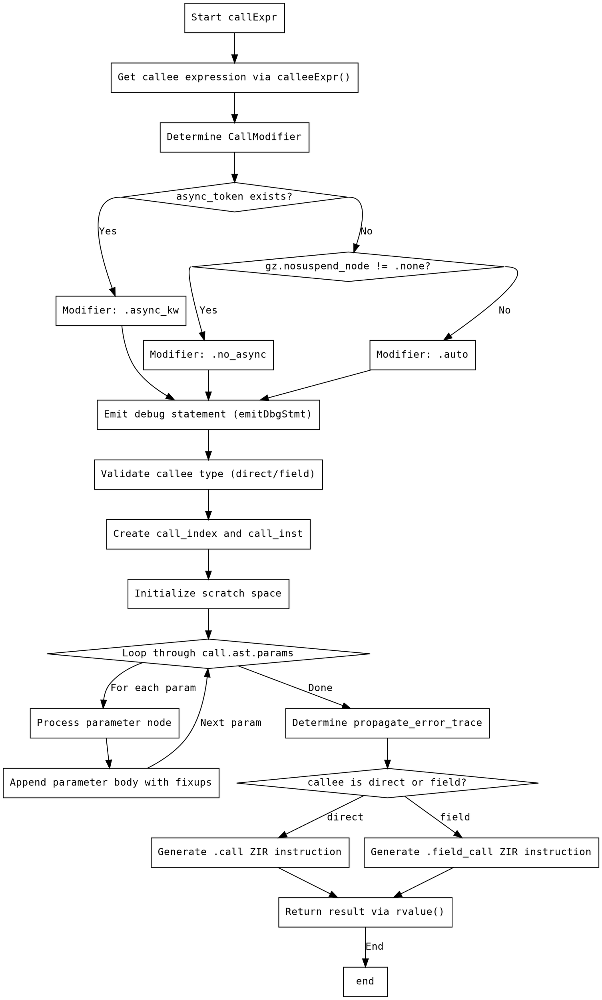

嗯，我现在需要为提供的Zig代码中的callExpr函数绘制一个流程图。首先，我得理解这个函数的结构和逻辑流程。函数名为callExpr，看起来是处理函数调用表达式的生成ZIR指令的部分。

首先，函数参数包括GenZir指针、作用域、结果信息、覆盖声明字面类型、节点和调用结构。接下来，函数内部有多个步骤，比如获取callee表达式，确定调用修饰符（async、no_async等），处理调试语句，然后根据callee的类型（direct或field）生成不同的ZIR指令。

我需要分步骤梳理代码的执行流程。比如，首先处理callee表达式，然后确定modifier，接着处理调试信息，然后创建call_index和call_inst。之后处理参数，可能使用scratch空间存储参数信息。然后根据是否传播错误跟踪来决定propagate_error_trace的值。最后根据callee的类型（direct或field）生成不同的ZIR指令，并返回结果。

接下来，我需要将这些步骤转化为流程图中的各个节点。可能的步骤包括：

1. 开始callExpr函数。
2. 获取callee表达式。
3. 确定调用修饰符（async、no_async、auto）。
4. 处理调试语句（emitDbgStmt）。
5. 验证callee的类型（direct或field）。
6. 创建call_index和call_inst。
7. 初始化scratch空间。
8. 遍历参数节点，处理每个参数表达式，生成相应的指令。
9. 确定propagate_error_trace的值。
10. 根据callee类型生成对应的ZIR指令（call或field_call）。
11. 返回结果。

需要注意条件分支，比如根据callee是direct还是field，处理不同的情况。另外，循环处理参数节点也是一个循环结构。

在绘制流程图时，需要用矩形框表示步骤，菱形框表示条件判断，箭头表示流程方向。例如，在确定modifier时，可能有三个分支：async_kw、no_async、auto。处理参数时，需要循环每个参数节点。最后的callee类型判断分为direct和field两种情况。

需要确保每个步骤之间的连接正确，特别是条件分支和循环部分。同时，注意错误处理和defer语句可能影响流程，但在这个函数中可能主要关注主流程，暂不涉及错误路径。

最后，将所有步骤整合成完整的流程图，使用Graphviz的DOT语言描述。
================================================
