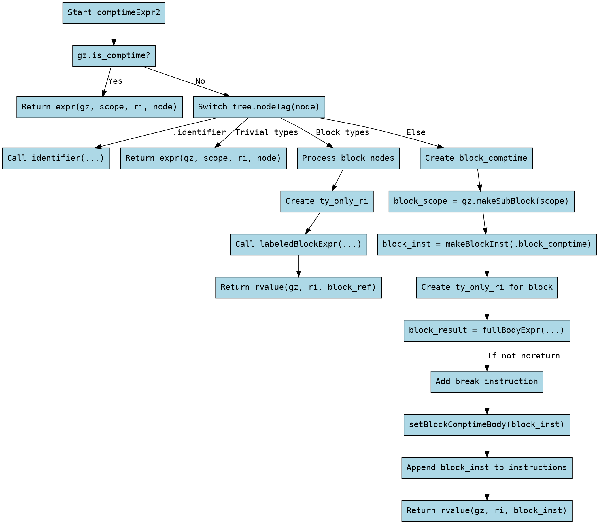

嗯，我需要为这个Zig函数`comptimeExpr2`绘制一个流程图。首先，我得仔细阅读代码，理解它的逻辑结构。函数的主要目的是处理在编译时求值的表达式，根据不同的节点类型进行优化，避免不必要的块包装。

首先，函数开始检查`gz.is_comptime`是否为真。如果是，直接返回`expr`的结果，无需其他处理。这是一个简单的条件分支。

接下来，对于非编译时的情况，函数会分析AST节点的类型。通过`switch`语句处理不同的节点类型。对于`.identifier`和一些特定的字面量或结构类型（如数字、字符串、错误值等），直接调用相应的处理函数，无需包装块。这部分可以视为多个并列的条件分支，每个分支对应不同的节点类型，处理方式相似。

对于块节点（如`.block_two`, `.block`等），需要进一步处理标签块，并调整结果位置。这里可能涉及到创建带标签的块，并处理结果值的复制。这部分逻辑较为复杂，需要生成子块，并处理可能的返回值。

如果节点类型不属于上述优化情况，则进入默认处理流程：创建一个新的编译时块（`block_comptime`），设置其作用域为编译时，生成块指令，处理内部表达式，最后添加中断指令并返回结果。这部分包括子作用域的创建、块的生成以及结果的处理。

在绘制流程图时，需要将这些条件分支和循环结构清晰地表示出来。每个`switch`的分支应作为不同的判断节点，尤其是处理不同AST类型的部分。对于块处理部分，需要展示子作用域的创建和块指令的生成过程。同时，注意处理结果位置和返回值的传递路径。

需要注意的是，`defer`语句在这里用于确保子作用域的正确释放，这在流程图中可能需要表示为资源清理步骤。此外，函数中的错误处理（`InnerError!`）可能需要在流程图中体现，比如可能的错误路径。

最后，将所有步骤用图形化的节点和箭头连接起来，确保逻辑流程正确，没有遗漏重要的判断和处理步骤。
================================================
