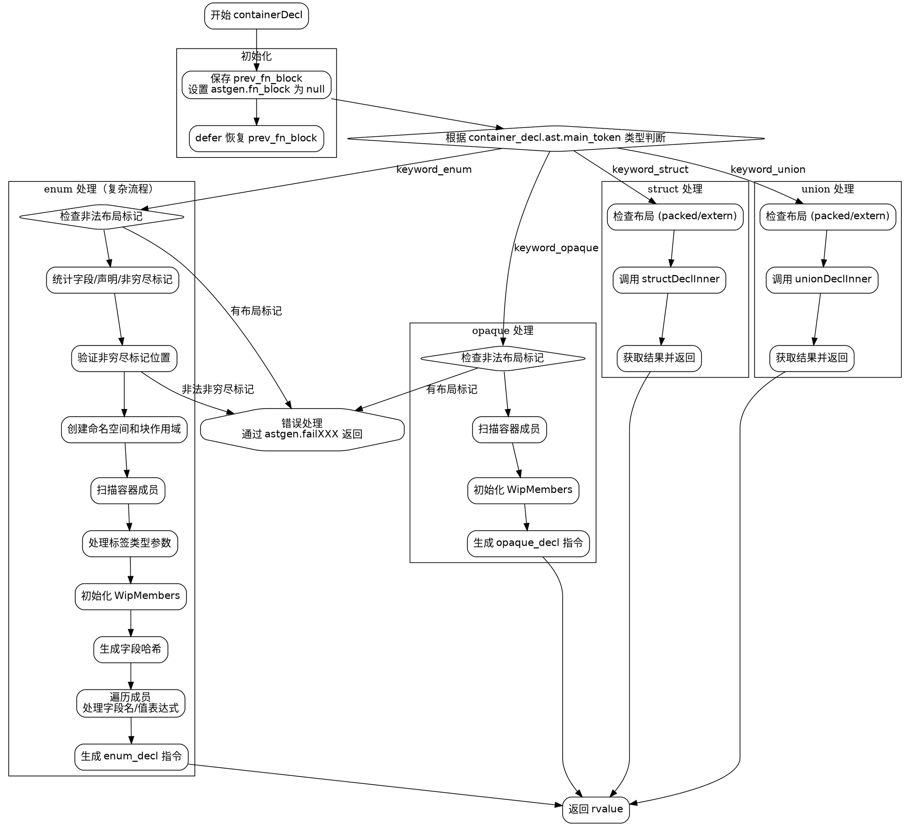

好的，我需要为给定的Zig函数`containerDecl`绘制流程图。首先，我得理解这个函数的结构和逻辑流程。

函数`containerDecl`处理不同类型的容器声明（如结构体、联合、枚举、不透明类型）。根据不同的容器类型，执行不同的代码分支。函数的大致流程如下：

1. **初始化阶段**：设置`astgen.fn_block`，并在函数结束时恢复。
2. **判断容器类型**：根据`container_decl.ast.main_token`的类型，进入不同的处理分支：
   - **struct**：处理结构体声明，调用`structDeclInner`。
   - **union**：处理联合声明，调用`unionDeclInner`。
   - **enum**：处理枚举声明，进行详细的成员检查、标签类型处理、字段哈希生成等。
   - **opaque**：处理不透明类型，检查成员是否合法。
3. **处理每个分支**：每个分支内部可能有子流程，如枚举类型需要处理非穷尽标记、计算字段值等。
4. **生成ZIR指令**：各分支最终会生成对应的ZIR指令，并通过`rvalue`返回结果。

接下来，我需要将这一流程转化为Graphviz的流程图。需要注意以下几点：

- **分支结构**：使用条件判断节点（菱形）区分不同的容器类型。
- **子流程处理**：每个分支内部的步骤需要详细展开，尤其是枚举类型的复杂处理。
- **错误处理**：部分步骤可能返回错误，需要在流程图中体现可能的错误出口。
- **函数返回**：每个分支最终返回结果，统一到`rvalue`。

可能遇到的挑战是枚举处理的复杂性，需要详细分解其步骤，如检查成员、处理标签类型、生成字段哈希等。此外，确保所有错误路径都被正确表示。

现在，我将根据以上分析绘制流程图，使用Graphviz的节点和箭头表示各步骤及其顺序。
================================================
