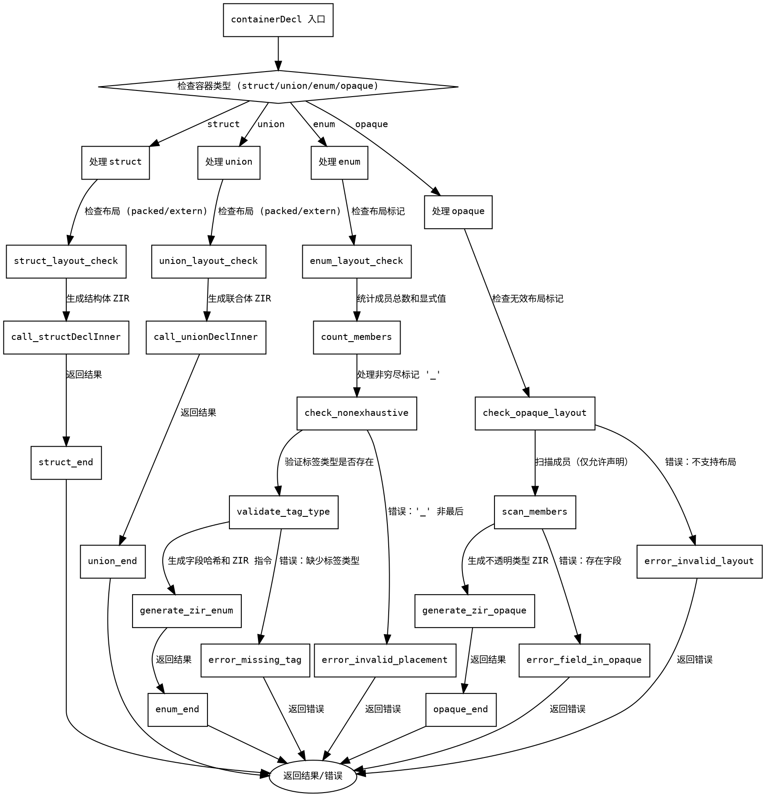

嗯，我需要为提供的Zig函数containerDecl生成一个Graphviz的流程图。首先，我得仔细阅读这段代码，理解它的结构和逻辑流程。

函数containerDecl处理容器声明，比如结构体、联合、枚举和不透明类型。根据不同的容器类型，它会执行不同的分支逻辑。例如，当遇到struct、union、enum或opaque时，分别有不同的处理方式。

流程图应该从函数入口开始，然后根据不同的容器类型分支出不同的处理路径。每个分支内部可能还有子步骤，比如检查布局、处理成员、生成ZIR指令等。需要注意的是错误处理部分，比如当枚举有无效标记时的错误返回。

首先，确定主要的条件分支。代码中的switch语句根据容器的类型（struct、union、enum、opaque）分派到不同的处理块。每个case块内部可能有循环处理成员、生成指令、处理错误等步骤。

接下来，需要将这些步骤转化为流程图中的节点和边。每个主要条件分支作为决策节点，然后各个处理步骤作为子节点。例如，在enum处理中，有计算成员数量、处理非穷尽标记、生成字段哈希等步骤。

同时，需要注意函数中的defer语句和错误返回，这些可能需要在流程图中表示异常流程。比如，当遇到错误时，直接返回错误，而不是继续后续步骤。

还要注意函数中的递归或嵌套结构，比如调用structDeclInner或unionDeclInner，但可能不需要展开这些函数的内部细节，只需在流程图中表示为一个节点。

最后，确保流程图的连贯性，每个步骤之间的箭头正确指向，条件分支明确，错误路径清晰。

可能的结构如下：

- 开始
- 判断容器类型
  - struct: 处理布局，调用structDeclInner，返回结果
  - union: 类似struct的处理
  - enum: 检查布局，计算成员数量，处理非穷尽标记，生成字段，处理标签值，生成ZIR指令
  - opaque: 检查布局，处理成员，生成不透明类型指令
- 错误处理在各个分支中可能出现，直接返回错误
- 结束返回结果

需要将这些步骤用Graphviz的节点和边表示，使用正确的形状（如菱形表示条件判断，矩形表示处理步骤，椭圆形表示开始结束等）。
================================================
