好的，我需要为给定的Zig函数`containerMember`绘制一个Graphviz流程图。首先，我需要仔细理解这个函数的结构和逻辑流程。

函数`containerMember`处理不同类型的容器成员，根据节点类型（通过`tree.nodeTag(member_node)`判断）执行不同的操作。每个case分支处理不同的节点类型，如容器字段、函数声明、变量声明等。每个分支都可能调用不同的函数（如`astgen.fnDecl`、`astgen.globalVarDecl`等），并在出错时添加失败的声明。

接下来，我需要将这个过程转化为流程图。流程图应该以开始节点开始，然后根据不同的节点类型分支到不同的处理步骤。每个分支可能会有成功或失败的情况，失败时执行错误处理并添加失败的声明，最后返回到`.decl`结果。

需要注意的是，每个case分支可能有不同的错误处理逻辑，例如在`fn_decl`分支中，如果`astgen.fnDecl`失败，会回滚`decl_index`并调用`addFailedDeclaration`。类似的情况也出现在其他分支中。

因此，流程图的结构大致如下：
1. 开始。
2. 判断节点类型。
3. 根据不同类型进入对应的处理流程。
4. 处理过程中可能成功或失败。
5. 失败时执行错误处理（回滚并添加失败声明）。
6. 所有分支处理完毕后返回`.decl`。

需要确保每个分支的条件和处理步骤都正确表示，并且错误处理路径清晰。使用Graphviz的节点和箭头来连接各个步骤，使用菱形表示判断节点，矩形表示处理步骤，箭头上的标签说明条件或结果。
================================================

```graphviz
digraph flowchart {
    node [shape=rectangle fontname="Courier" fontsize=12];
    edge [fontname="Courier" fontsize=10];

    start [label="开始containerMember"];
    switch_node [label="switch(tree.nodeTag(member_node))" shape=diamond];
    end [label="返回.decl"];

    start -> switch_node;

    // 容器字段分支
    subgraph cluster_container_fields {
        label="容器字段处理";
        container_fields_case [label=".container_field*"];
        container_fields_result [label="返回ContainerMemberResult{ .field = ... }"];
        container_fields_case -> container_fields_result;
    }

    // 函数声明分支
    subgraph cluster_fn_decl {
        label="函数声明处理";
        fn_decl_case [label=".fn_proto*/.fn_decl"];
        process_fn_decl [label="astgen.fnDecl()"];
        handle_fn_error [label="错误处理：回滚decl_index\n添加失败声明"];
        fn_decl_case -> process_fn_decl;
        process_fn_decl -> end [label="成功"];
        process_fn_decl -> handle_fn_error [label="AnalysisFail"];
        handle_fn_error -> end;
    }

    // 变量声明分支
    subgraph cluster_var_decl {
        label="变量声明处理";
        var_decl_case [label=".global_var_decl*"];
        process_var_decl [label="astgen.globalVarDecl()"];
        handle_var_error [label="错误处理：回滚decl_index\n添加失败声明"];
        var_decl_case -> process_var_decl;
        process_var_decl -> end [label="成功"];
        process_var_decl -> handle_var_error [label="AnalysisFail"];
        handle_var_error -> end;
    }

    // comptime分支
    subgraph cluster_comptime {
        label="comptime处理";
        comptime_case [label=".comptime"];
        process_comptime [label="astgen.comptimeDecl()"];
        handle_comptime_error [label="错误处理：回滚decl_index\n添加失败声明"];
        comptime_case -> process_comptime;
        process_comptime -> end [label="成功"];
        process_comptime -> handle_comptime_error [label="AnalysisFail"];
        handle_comptime_error -> end;
    }

    // usingnamespace分支
    subgraph cluster_usingnamespace {
        label="usingnamespace处理";
        usingnamespace_case [label=".usingnamespace"];
        process_usingnamespace [label="astgen.usingnamespaceDecl()"];
        handle_usingnamespace_error [label="错误处理：回滚decl_index\n添加失败声明"];
        usingnamespace_case -> process_usingnamespace;
        process_usingnamespace -> end [label="成功"];
        process_usingnamespace -> handle_usingnamespace_error [label="AnalysisFail"];
        handle_usingnamespace_error -> end;
    }

    // test_decl分支
    subgraph cluster_test_decl {
        label="测试声明处理";
        test_decl_case [label=".test_decl"];
        process_test_decl [label="astgen.testDecl()"];
        handle_test_error [label="错误处理：回滚decl_index\n添加失败声明"];
        test_decl_case -> process_test_decl;
        process_test_decl -> end [label="成功"];
        process_test_decl -> handle_test_error [label="AnalysisFail"];
        handle_test_error -> end;
    }

    // 连接主switch节点
    switch_node -> container_fields_case [label="container_field*"];
    switch_node -> fn_decl_case [label="fn_proto*/.fn_decl"];
    switch_node -> var_decl_case [label="global_var_decl*"];
    switch_node -> comptime_case [label=".comptime"];
    switch_node -> usingnamespace_case [label=".usingnamespace"];
    switch_node -> test_decl_case [label=".test_decl"];
    container_fields_result -> end;
}
```
