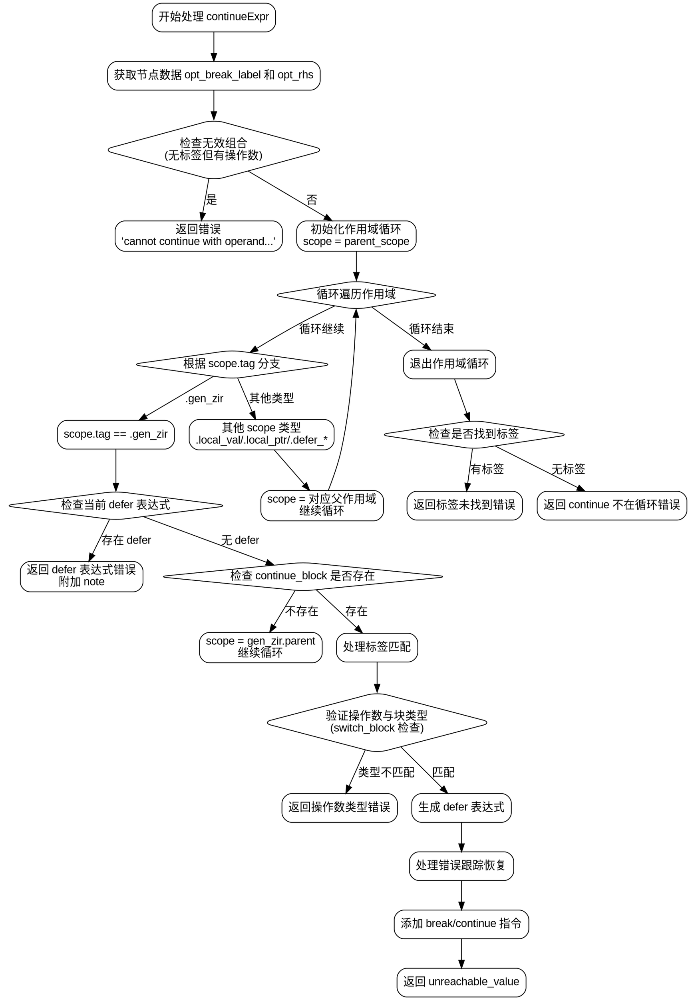

好的，我需要为给定的Zig函数`continueExpr`生成一个Graphviz流程图。首先，我需要理解这个函数的结构和逻辑流程。

函数的主要逻辑是处理`continue`表达式，包括检查标签、作用域遍历、错误处理等。函数开始于获取AST节点数据，然后检查是否有无效的标签和操作数组合。接下来，通过循环遍历作用域，寻找合适的`GenZir`作用域来处理`continue`。在遍历过程中，会检查是否存在`defer`表达式，确定是否允许继续执行。如果找到匹配的标签，会进一步验证操作数是否符合当前块的类型（如`switch`块）。根据不同的情况，生成相应的ZIR指令，处理错误跟踪，最后添加`break`或`continue`指令。如果遍历完所有作用域仍未找到合适的标签，则返回错误。

接下来，我需要将这些逻辑步骤转化为流程图中的节点和边。需要注意条件判断的分支，例如`if`语句、循环中的`switch`情况等。每个条件分支都应有一个对应的节点和边。此外，错误处理和返回路径也需要明确标出。

需要注意的是，Graphviz使用DOT语言，节点用矩形或菱形表示，边用箭头连接。条件判断通常用菱形节点，处理步骤用矩形节点。需要确保所有可能的路径都被覆盖，包括错误路径和正常返回路径。

在绘制过程中，可能会遇到复杂的作用域遍历和嵌套条件，需要仔细分解每一步，确保流程图的准确性和可读性。同时，需要避免节点之间的交叉和混乱，合理排列节点位置，使流程图结构清晰。
================================================
