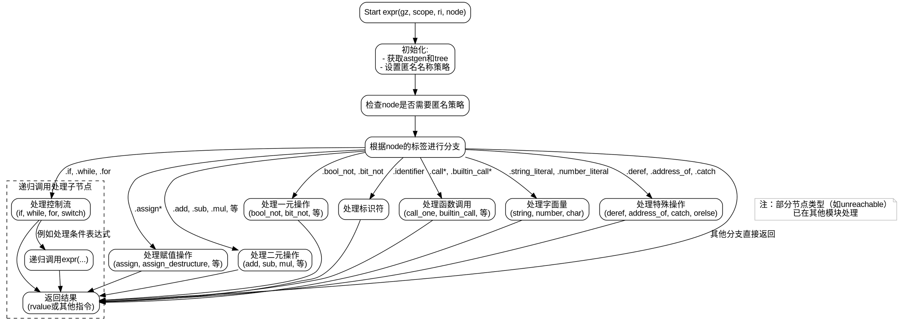

嗯，我需要为提供的Zig函数`expr`绘制一个流程图。首先，我需要理解这个函数的结构。看起来这是一个处理抽象语法树（AST）节点的函数，根据不同的节点类型执行不同的操作，生成ZIR指令。

函数开始处有一些初始设置，比如处理匿名名称策略，然后通过一个大的switch语句处理不同的节点类型。每个case处理特定的AST节点，并调用相应的函数，比如`assign`、`simpleBinOp`、`fieldAccess`等。最后，返回生成的ZIR指令引用。

绘制流程图时，应该从函数入口开始，处理初始设置，然后进入switch语句的分支。每个case对应一个处理流程，可能会有子函数调用，最后返回结果。需要考虑所有可能的节点类型，但可能不需要每个都详细展开，尤其是那些标记为`unreachable`的，因为它们可能在别处处理。

需要注意的是，流程图应该使用Graphviz的DOT语言，而不是Mermaid。我需要确保每个判断节点和操作步骤正确连接，包括错误处理和返回路径。

可能需要将主要的switch分支作为决策节点，每个节点类型对应一个处理块，然后根据处理结果流向返回语句。对于复杂的子函数调用，可能需要在流程图中简化为一个步骤，除非有特别重要的逻辑需要展开。

需要检查是否有循环或递归调用，比如`expr`函数可能递归调用自身处理子节点。这在流程图中需要适当表示，可能需要使用子图或标注递归点。

最后，确保流程图的结构清晰，节点和边的标签正确，符合Graphviz的语法要求。
================================================
