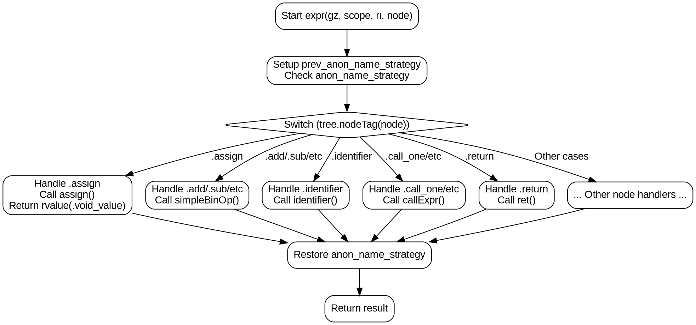

好的，我需要为给定的Zig函数`expr`绘制一个流程图。首先，我需要理解这个函数的结构和逻辑。

函数`expr`是一个处理抽象语法树（AST）节点的大函数，根据不同的节点类型执行不同的操作。它使用了一个大的`switch`语句来分派不同的处理函数。我的任务是将这个复杂的函数转化为流程图。

首先，流程图的起点应该是函数开始，处理参数，设置`prev_anon_name_strategy`，然后根据`tree.nodeTag(node)`进行分支。每个`switch`的分支对应不同的AST节点类型，例如`.assign`、`.add`、`.identifier`等等，每个分支调用不同的处理函数，如`assign`、`simpleBinOp`、`identifier`等，最后返回结果。

接下来，我需要将这些分支结构可视化。每个`switch`分支可以表示为一个决策节点，然后根据不同的节点类型分支出不同的处理流程。由于分支非常多，可能需要将主要的分支归类，或者用子流程图来处理复杂的部分，以避免主流程图过于庞大。

需要注意的是，函数中有很多`unreachable`的情况，这些可能是顶层声明或其他已处理的节点类型，在流程图中可以标记为终止节点或直接忽略。另外，一些分支会调用其他函数，如`assign`、`rvalue`等，这些调用可以作为流程中的步骤节点。

在处理每个分支时，需要关注它们如何修改`gz`（可能是生成ZIR的上下文），如何处理作用域`scope`，以及如何返回结果。例如，`.assign`分支调用`assign`函数，然后调用`rvalue`返回结果，而`.add`分支直接调用`simpleBinOp`并返回。

由于函数中存在大量的分支，可能需要分层绘制，先画出主分支，然后在子流程中展开每个主要处理函数的具体步骤。例如，将`simpleBinOp`作为一个子流程，详细展示其内部步骤。

此外，函数中有`defer`语句恢复`anon_name_strategy`，这在流程图中需要体现为无论哪个分支执行后，都会执行这个恢复操作。这可以通过在流程图的结束部分添加一个共同的节点来表示。

最后，需要确保流程图的逻辑清晰，节点之间的箭头正确表示执行顺序，特别是错误处理和提前返回的情况。可能需要使用不同的形状来表示开始、结束、处理步骤、决策节点等。

总结步骤：
1. 确定函数入口和初始设置。
2. 绘制主决策节点（switch语句）。
3. 为每个主要的节点类型创建分支。
4. 每个分支调用对应的处理函数，并最终返回结果。
5. 处理共同的收尾操作（如defer恢复）。
6. 使用子流程简化复杂处理函数的分支。
7. 检查所有可能的路径，确保流程图完整性。
================================================
