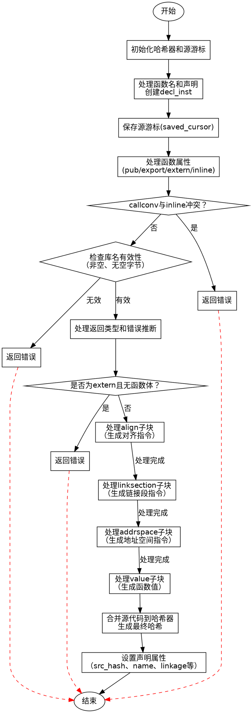

好的，我现在需要为提供的Zig代码中的`fnDecl`函数绘制流程图。首先，我需要理解这个函数的结构和逻辑流程。让我先通读代码，了解每个部分的作用。

函数`fnDecl`的参数包括`astgen`、`gz`、`scope`、`wip_members`、`decl_node`、`body_node`和`fn_proto`。看起来这个函数处理函数声明的生成，可能与抽象语法树（AST）和ZIR生成有关。

代码开始部分处理了一些哈希和源游标的操作，比如保存旧的哈希器状态，初始化新的哈希器，并更新源列信息。接着，获取函数名称的token，并创建了一个声明指令`decl_inst`。然后，保存和恢复源游标的位置，处理函数的可见性（如`pub`、`export`、`extern`、`inline`）以及库名检查。

接下来，处理返回类型和错误推断，检查是否有函数体。如果函数是`extern`但没有函数体，会抛出错误。然后，处理对齐、链接部分、地址空间等属性，每个属性对应一个子块（如`align_gz`、`linksection_gz`、`addrspace_gz`、`value_gz`）。

最后，将完整的源代码合并到哈希器中，生成最终的哈希，并设置声明的各种属性。

现在需要将这些步骤转化为流程图。流程图通常包括开始、结束、判断、处理步骤等。可能的步骤包括：

1. 初始化哈希器和源游标。
2. 处理函数名称和声明。
3. 保存源游标。
4. 处理函数属性（pub/export/extern/inline）。
5. 检查库名有效性。
6. 处理返回类型和错误推断。
7. 验证是否存在函数体（如果是extern）。
8. 处理对齐、链接部分、地址空间等子块。
9. 生成函数值（如果不是extern）。
10. 合并源代码到哈希，生成最终哈希。
11. 设置声明属性。

在判断部分，例如检查是否是extern、是否有函数体、是否有对齐表达式等，会有分支。每个子块（align_gz等）的处理可能需要独立的流程步骤，并可能涉及错误处理。

需要注意的是，代码中有多个defer语句，用于恢复状态，这在流程图中可能需要表示成堆栈操作或子流程。例如，每个`makeSubBlock`创建的子块需要在处理完后unstack，这可能对应子流程的返回。

可能的结构是：

- 开始
- 初始化部分
- 处理函数名和声明
- 处理函数属性（判断是否是pub/export/extern等）
- 处理库名（如果有）
- 处理返回类型和错误推断
- 判断是否有函数体，如果是extern则检查
- 处理各个子块（align, linksection, addrspace, value）
- 生成哈希并设置声明
- 结束

对于每个条件判断，如`if (fn_proto.ast.align_expr.unwrap())`，需要分yes/no分支。此外，错误处理（如return语句）应作为流程的中断点。

现在，将这些步骤用Graphviz的节点和边表示出来。可能需要使用矩形框表示处理步骤，菱形表示判断，箭头表示流程方向。同时，子块的处理可能需要嵌套或独立的部分。

不过，Graphviz的流程图是平面的，无法直接表示嵌套结构，但可以通过分组和颜色来区分不同的部分。例如，每个子块的处理可以放在一个虚线框内，表示它们属于同一子处理流程。

由于代码中有多个恢复源游标的操作（`astgen.restoreSourceCursor(saved_cursor);`），这在流程图中可能需要标注，但为了简洁，可以合并到对应的处理步骤中。

最终的流程图可能需要以下节点和边：

开始 -> 初始化哈希和源游标
初始化 -> 处理函数名和声明
处理声明 -> 保存源游标
保存游标 -> 处理函数属性（pub/export/extern/inline）
处理属性 -> 检查库名（如果有）
检查库名 -> 处理返回类型和错误推断
处理返回类型 -> 判断是否有函数体（如果是extern）
判断函数体 -> 是extern且无函数体？错误处理
判断函数体 -> 非extern则处理子块
处理子块（align, linksection, addrspace, value）按顺序进行
处理完子块 -> 合并源代码到哈希
合并哈希 -> 设置声明属性
设置属性 -> 结束

每个子块的处理可能包括判断是否有对应的表达式，如果有则执行相应处理，否则跳过。例如，处理对齐表达式时，判断是否有align_expr，如果有则生成指令，否则继续。

错误处理部分，如`return astgen.failTok`等，应作为流程的中断点，可能直接指向结束或错误节点。

可能需要将代码中的错误检查转换为判断节点，例如：

- 检查库名是否包含空字节或为空：如果是，返回错误。
- 检查是否同时有callconv和inline：如果是，返回错误。
- 检查非extern函数是否有body：如果没有，返回错误。

这些判断节点会有两个分支：符合条件则错误，否则继续流程。

总结，流程图的结构大致如下：

开始
初始化
处理函数声明
处理属性（pub/export/extern等）
处理库名（如果有）→ 错误检查
处理返回类型和错误推断 → 错误检查
检查是否有body（extern时必须有body？）
处理各个子块（align, linksection, addrspace, value）
合并源代码到哈希
设置声明属性
结束

现在需要将这些步骤转换为Graphviz的DOT语言。注意节点之间的连接，判断节点的yes/no分支，以及错误处理的路径。

可能的节点ID和标签：

node0 [label="开始", shape=ellipse]
node1 [label="初始化哈希和源游标"]
node2 [label="处理函数名和声明"]
node3 [label="保存源游标"]
node4 [label="处理函数属性（pub/export/extern/inline）"]
node5 [label="处理库名（如果有）"]
node6 [label="库名有效？", shape=diamond]
node7 [label="返回错误", shape=box]
node8 [label="处理返回类型和错误推断"]
node9 [label="是否有body？", shape=diamond]
node10 [label="返回错误"]
node11 [label="处理align子块"]
node12 [label="处理linksection子块"]
node13 [label="处理addrspace子块"]
node14 [label="处理value子块"]
node15 [label="合并源代码到哈希"]
node16 [label="设置声明属性"]
node17 [label="结束", shape=ellipse]

边：

node0 -> node1
node1 -> node2
node2 -> node3
node3 -> node4
node4 -> node5
node5 -> node6
node6 -> node7 [label="无效"]
node6 -> node8 [label="有效"]
node8 -> node9
node9 -> node10 [label="extern且无body"]
node9 -> node11 [label="其他情况"]
node11 -> node12
node12 -> node13
node13 -> node14
node14 -> node15
node15 -> node16
node16 -> node17

同时，其他错误路径如callconv与inline冲突、非extern无body等也需要添加判断节点。例如，在处理属性时，检查是否有callconv_expr和inline关键字，如果有则返回错误。

可能需要在处理属性后添加一个判断节点：

node4a [label="callconv与inline冲突？", shape=diamond]
node4 -> node4a
node4a -> node7 [label="是"]
node4a -> node5 [label="否"]

类似地，处理返回类型时，如果是extern且有inferred错误，也需要错误检查：

node8a [label="extern且有inferred错误？", shape=diamond]
node8 -> node8a
node8a -> node7 [label="是"]
node8a -> node9 [label="否"]

这样，流程图会覆盖所有可能的错误情况。

此外，处理各个子块时，每个子块是否有对应的表达式需要处理：

例如，处理align子块时：

node11 [label="处理align子块"]
node11a [label="是否有align_expr？", shape=diamond]
node11 -> node11a
node11a -> node11b [label="有"]
node11a -> node12 [label="无"]
node11b [label="生成align指令"]

类似地处理其他子块。

这会使流程图变得复杂，但需要尽可能详细地反映代码逻辑。

综上所述，最终的DOT代码需要涵盖所有主要步骤、判断和错误处理路径。可能需要多次调整节点顺序和连接，以确保流程正确。
================================================

该流程图的关键点说明：
1. **错误处理**用红色虚线箭头表示，所有错误路径最终指向结束节点
2. **子块处理**（align/linksection/addrspace/value）按顺序执行
3. 主要逻辑分支：
   - callconv与inline关键字冲突检查
   - 库名校验
   - extern函数体存在性检查
4. 最后完成哈希计算和声明属性设置后结束流程

每个菱形节点代表一个逻辑判断，矩形节点代表具体操作步骤。通过颜色和箭头类型区分正常流程和错误处理流程。