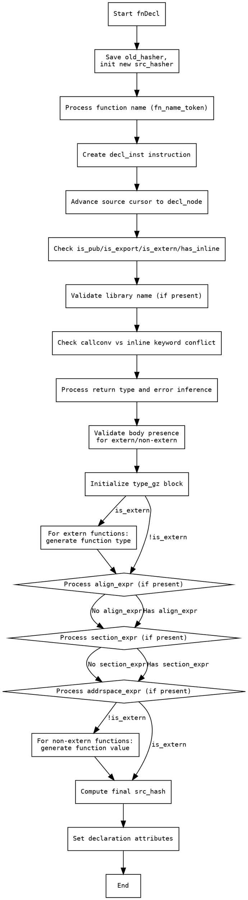

好的，我需要为给定的Zig函数`fnDecl`绘制一个流程图。首先，我需要理解这个函数的逻辑流程，然后将其转化为Graphviz的DOT语言。让我仔细看看代码的结构。

函数开始于保存旧的`src_hasher`，并初始化新的。接着处理函数名，创建声明指令，并更新源码位置。然后处理可见性、导出、外部等关键字，检查库名称的有效性。之后处理返回类型，验证是否存在函数体，以及错误推断。然后初始化各种生成ZIR的块（type_gz, align_gz等），处理对齐、链接段、地址空间等属性。对于非外部函数，调用`fnDeclInner`生成内部代码。最后计算哈希，设置声明属性。

我需要将这些步骤分解为不同的节点，并根据条件判断添加分支。例如，处理`is_extern`、是否有`align_expr`等条件。每个条件判断对应一个分支，不同的处理路径。同时，注意各个块的创建和解除顺序，使用`makeSubBlock`和`unstack`，可能需要表示这些子块的关系。

可能的节点包括：初始化hasher、处理函数名、创建decl_inst、处理可见性和关键字、验证库名、处理返回类型和错误推断、初始化各生成块（type_gz, align_gz等）、处理对齐、链接段、地址空间、生成函数体（如果不是extern）、计算哈希、设置声明属性等。

需要确定各个步骤之间的顺序和条件，如是否存在`align_expr`等。可能使用菱形表示条件判断，矩形表示操作步骤，箭头表示流程方向。

需要注意函数中的defer语句，例如`defer astgen.within_fn = prev_within_fn;`，这可能会影响流程，但在流程图中可能不需要特别表示，因为defer是在函数退出时执行，而流程图主要关注主流程。

现在，将这些步骤转化为Graphviz的节点和边，确保条件分支正确，各子块的处理顺序正确。例如，处理type_gz后，接着处理align_gz，每个可能存在或不存在的情况都需要分支。

可能需要将各个子块（如align_gz、linksection_gz等）的处理作为独立的子流程，但为了简化，可能将它们作为顺序步骤，条件判断是否存在对应的表达式。

最后，确保所有可能的路径都被覆盖，比如当`is_extern`为真时跳过生成函数体，或者当有`align_expr`时处理对齐等。
================================================
