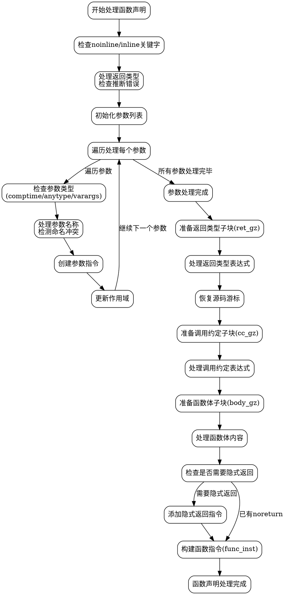

嗯，用户让我用Graphviz来画这个Zig函数fnDeclInner的流程图，而且不能用Mermaid。首先，我需要仔细理解这个函数的逻辑结构。函数fnDeclInner看起来是处理函数声明的内部逻辑，生成ZIR指令。函数参数很多，处理各种情况，比如参数类型、返回类型、调用约定等。

首先，我需要分解这个函数的各个步骤。函数开始部分检查是否有noinline或inline关键字，处理返回类型是否有感叹号（推断错误类型）。然后处理参数，包括参数名称、类型、是否是comptime、anytype或var args。接着处理返回类型和调用约定，创建不同的GenZir子块（如ret_gz、cc_gz、body_gz）。之后处理函数体，包括隐式返回，最后生成func_inst并添加到decl_gz中。

接下来，我需要把这些步骤转化为流程图节点。每个主要处理阶段作为一个节点，比如参数处理、返回类型处理、调用约定处理、函数体处理等。条件判断部分需要分支，例如检查is_noinline、has_inline_keyword、is_var_args等。循环处理参数的部分可能需要一个循环节点，但考虑到Graphviz的结构，可能需要用条件节点来表示循环的入口和出口。

需要注意函数中的错误处理，比如try表达式，可能需要作为异常流程的分支。不过用户可能更关注主流程，所以暂时先忽略错误处理，或者用简单的节点表示。

然后，确定各个节点之间的连接关系。例如，处理参数之后进入返回类型处理，然后是调用约定，再是函数体，最后生成函数指令。每个子块（如ret_gz、cc_gz、body_gz）的创建和销毁（unstack）可能需要单独的节点。

可能遇到的挑战是如何将复杂的逻辑分支和循环用Graphviz清晰地表示出来，避免过于复杂的交叉连线。需要合理分组，使用子图（subgraph）来组织相关步骤，比如参数处理、返回类型处理等部分作为子图。

另外，函数中使用的变量和状态变化，比如any_param_used、noalias_bits、param_insts等，可能需要在流程图中标注，但为了简洁，可能只保留主要步骤。

最后，确保符合Graphviz的语法，使用正确的节点和箭头，合理布局，使流程图易于理解。
================================================
