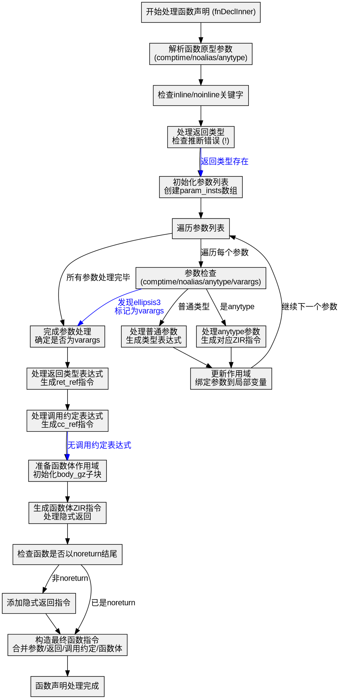

嗯，我需要为这个Zig函数`fnDeclInner`画一个流程图。首先，我得理解这个函数的结构和各个部分的逻辑。让我先通读一下代码，看看它是如何工作的。

函数`fnDeclInner`似乎负责生成ZIR（Zig Intermediate Representation）中的函数声明部分。它处理函数的参数、返回类型、调用约定，以及函数体。代码中有很多条件判断和循环，处理不同的参数类型，比如`comptime`、`noalias`、`anytype`等，还有错误检查和处理。

接下来，我需要确定流程图的主要步骤。可能包括：
1. 解析函数原型（参数、返回类型、调用约定）。
2. 处理每个参数，包括类型推导、作用域管理。
3. 生成返回类型的ZIR指令。
4. 处理函数体，生成对应的ZIR代码。
5. 处理隐式返回和错误跟踪。
6. 构造最终的函数指令并添加到ZIR中。

在画流程图的时候，需要注意条件分支，比如是否有`comptime`关键字、`anytype`参数，以及是否是可推断错误返回类型。同时，循环处理参数部分需要表示出来，比如遍历所有参数并生成对应的指令。

可能需要使用不同的图形元素：矩形框表示处理步骤，菱形表示条件判断，箭头表示流程方向。还要注意错误处理路径，比如`astgen.failTok`等错误情况的处理。

另外，函数中有多个子块（`GenZir`结构体的子块），比如`param_gz`、`ret_gz`、`cc_gz`、`body_gz`，这些子块的处理流程也需要在流程图中体现出来，可能作为子流程或并行处理的部分。

需要注意变量的作用域变化，比如`params_scope`随着每个参数的解析而更新。这可能需要在流程图中用不同的区域或颜色来表示作用域的变化。

最后，确保流程图的逻辑顺序正确，没有遗漏关键步骤，尤其是错误处理和资源释放（如`defer`语句）的部分。

可能需要多次迭代，先画出大致的框架，再逐步细化每个部分的条件和处理流程。确保每个判断条件都有明确的是/否分支，并且每个处理步骤清晰明了。
================================================
