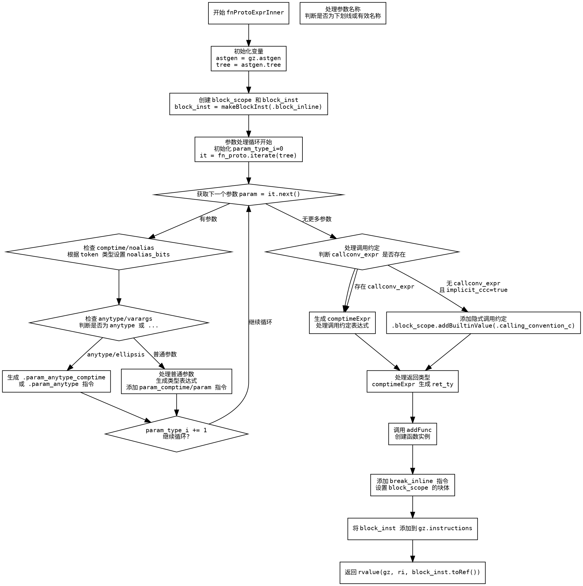

嗯，我需要为这个Zig函数生成流程图。首先，我需要理解这个函数的结构和流程。让我先通读一遍代码，看看它是做什么的。

这个函数叫做fnProtoExprInner，看起来是处理函数原型表达式的。参数中有GenZir指针、作用域、结果信息、AST节点、函数原型等。返回类型是Zir.Inst.Ref。函数内部有一些变量声明，比如astgen、tree，然后创建了一个block_scope，并推迟了unstack操作。接着创建了一个block_inst，用于块指令。

然后，处理函数的参数部分。有一个循环遍历函数原型的参数，处理每个参数的属性，比如comptime、noalias、anytype等。对于每个参数，可能会生成不同的Zir指令，比如param_anytype_comptime或者param_comptime。这里需要处理参数名、类型表达式等。

接下来处理调用约定（callconv_expr），如果有显式的调用约定表达式，就生成相应的指令；否则，如果是隐式的，就添加默认的调用约定。然后处理返回类型节点，生成返回类型的Zir指令。

之后，使用block_scope.addFunc来创建函数实例，设置各种属性，如cc_ref、ret_ref、param_block等。最后添加break指令，设置块体，并将block_inst添加到gz的指令列表中。最后返回rvalue的结果。

现在我需要把这些步骤转化为流程图。流程图应该从函数入口开始，按照步骤分块，包括变量初始化、参数处理、调用约定处理、返回类型处理、创建函数实例、结束块并返回结果等步骤。

需要注意条件分支，比如是否存在callconv_expr，是否是隐式调用约定，参数是否是anytype或者var args等。此外，循环处理参数的部分可能会有多次迭代，每个参数的处理流程需要正确表示。

可能的结构：

1. 开始
2. 初始化变量（astgen, tree）
3. 创建block_scope和block_inst
4. 处理参数循环：
   a. 对于每个参数，检查comptime/noalias
   b. 处理anytype或var args
   c. 生成参数指令
5. 处理调用约定（条件判断）
6. 处理返回类型
7. 创建函数实例（addFunc）
8. 添加break指令，设置块体
9. 返回结果

需要将这些步骤用graphviz的节点和箭头连接起来，条件判断用菱形节点，循环用适当的流程表示。例如，处理参数的循环可能需要一个循环结构，但graphviz中通常用条件判断和返回箭头来表示循环。

需要确保所有可能的路径都被覆盖，比如是否存在callconv_expr的不同情况，参数处理中的不同分支等。同时，错误处理（如try操作）可能也需要考虑，但可能在这个流程图中省略，除非有显式的错误分支。

可能还需要注意函数中的延迟操作（defer block_scope.unstack()），但可能在流程图中不需要特别表示，除非它影响流程。

现在，将这些步骤转化为graphviz的digraph结构，使用节点和边来表示流程，条件判断使用菱形节点，处理步骤使用矩形节点，循环用箭头回指。
================================================
