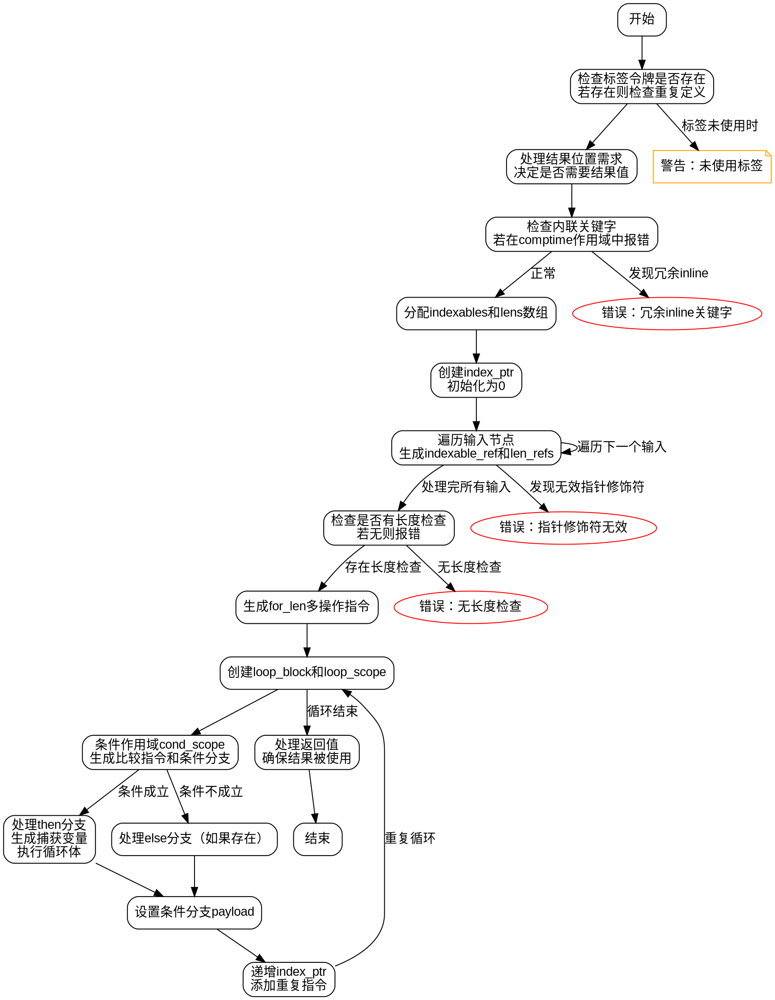

嗯，我现在需要为这个Zig函数`forExpr`画一个流程图。首先，我得仔细阅读代码，理解它的结构和逻辑流程。这个函数看起来是处理`for`循环表达式的AST生成ZIR指令的部分。函数参数包括父GenZir指针、作用域、结果信息、节点、完整的for循环AST结构，以及是否是语句的标志。

首先，函数开始检查是否有标签令牌，如果有的话会检查标签是否重复定义。然后处理结果位置（rl）的需求，决定是否需要结果值。接着处理内联关键字，如果父作用域是编译时且存在内联令牌，会报错。

接下来，处理循环的输入（indexables和lens），分配内存来存储这些信息。然后创建index_ptr，可能是循环计数器，初始化为0。然后遍历输入，处理每个输入节点，可能是范围或索引，生成相应的ZIR指令，并填充indexables和lens数组。如果没有长度检查，会报错。

之后，生成一个多操作指令来断言所有长度，确保循环条件正确。然后创建循环块（loop_block），进入循环作用域，处理条件判断，条件分支，然后处理then和else分支。在then分支中，处理捕获变量，生成相应的捕获指令，并处理循环体。else分支处理可能的else表达式，最后设置条件分支的payload，处理循环的递增和重复。

最后，根据是否需要结果值，返回相应的结果，并确保如果是语句，结果被使用。

现在，我需要将这些步骤转化为流程图。流程图应该包括开始和结束节点，各个主要步骤，条件判断，循环处理，以及错误处理部分。需要注意各个子作用域的处理，如loop_scope、cond_scope、then_scope、else_scope等，以及它们的连接关系。

可能的节点包括：

1. 开始：处理标签检查，初始化变量。
2. 检查内联关键字是否冗余。
3. 分配indexables和lens数组。
4. 创建index_ptr并初始化为0。
5. 遍历输入，处理每个输入节点，生成indexable_ref和len_refs。
6. 检查是否有长度检查，否则报错。
7. 生成for_len指令。
8. 创建loop_block和loop_scope。
9. 条件判断：cond_scope生成比较指令，条件分支。
10. 处理then分支：生成捕获变量，执行循环体。
11. 处理else分支（如果有的话）。
12. 设置条件分支的payload。
13. 递增index_ptr，重复循环。
14. 处理结果返回，确保结果被使用。
15. 错误处理节点（如果有错误发生）。

流程图中需要处理的条件包括：是否有标签令牌，是否需要结果值，是否是内联循环，输入节点是范围还是索引，是否有长度检查，是否有else表达式等。

需要注意的是，在代码中存在多个子作用域（如loop_scope、cond_scope、then_scope、else_scope），它们的创建和结束需要用子流程或子图来表示。同时，循环的结构（条件判断、循环体、递增）需要正确连接。

可能的结构是：

开始 -> 检查标签 -> 处理rl -> 检查内联冗余 -> 分配数组 -> 初始化index_ptr -> 遍历输入处理每个节点 -> 检查长度 -> 生成for_len -> 创建loop_block -> 进入循环 -> 条件判断（cond_scope） -> 条件分支 -> then处理 -> else处理 -> 设置条件分支payload -> 递增index_ptr -> 重复循环 -> 处理结果 -> 结束。

其中，循环部分可能需要回到条件判断，形成循环结构。错误处理节点需要连接到可能出错的地方，如标签重复、内联冗余、无长度检查等。

另外，代码中的错误处理（如astgen.failTok等）应该对应到流程图中的错误节点，并终止流程。

总结，流程图需要详细覆盖所有主要步骤和条件分支，正确表示循环结构和作用域嵌套，确保逻辑清晰。
================================================

该流程图使用Graphviz绘制，主要特点包括：

1. 使用圆角矩形表示操作步骤
2. 使用红色椭圆表示错误节点
3. 使用橙色便签表示警告
4. 清晰标注了：
   - 标签检查流程
   - 内联关键字验证
   - 输入处理循环
   - 双重条件分支（then/else）
   - 索引递增和循环重复机制
   - 结果处理逻辑
5. 通过虚线箭头表示循环重复路径
6. 包含所有关键错误检查路径
7. 使用分层结构展示作用域嵌套关系

可以通过Graphviz工具（如VSCode的Graphviz插件或在线编辑器）渲染查看完整流程图结构。